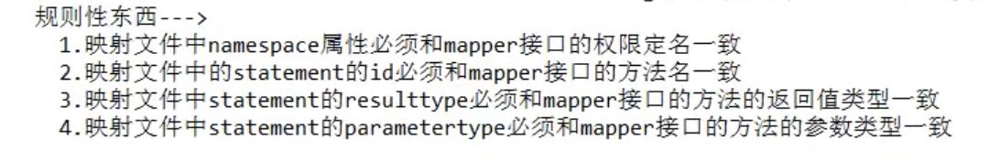

## 当出现要获取最近插入数据的自增id

```xml
<selectKey order="after">select last_inset_id() </selectKey>
```

## mybatisConfig.xml 

一对一映射

1. 在主对象里面添加一个副对象的属性
2. xml里面 resultMap里面加上一个 association 
3. 注意sql语句取别名


一对多映射

1. 在主对象里面加一个副对象的集合属性
2. 在xml的resultMap里面加上collection


resultMap有extends继承映射 可继承父resultMap的所有属性


延时加载

1. 默认是没有开启延时加载的
2. 要在mbatis的配置文件xml里的setting标签里加上更新延时加载的配置
3. 在Mapper里额外定义一个需要的标签
4. resultMap某个要延时加载的字段加上select属性 值为步骤3的id column属性为第二次查询中作为查询条件的数据来源


properties 别名

```xml
<properties resourse="student.properties"></properties>
后面可以使用${student.name}
```

```xml
<typeAliases>
  <package name="com.xian.entity"></package>
</typeAliases>
后面returnType就可以省略前面的包名了
```

## sqlSession的getMapper代理对象

实现了上层对 sqlsession的封装




