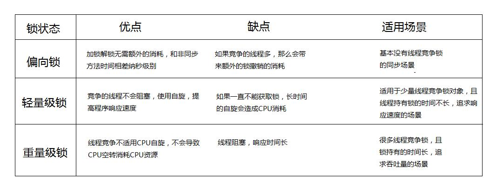

# JAVA基础

## 基础

#### final关键词

作用 

final修饰变量如果修饰的是基本数据类型，那么这个值一经赋值那么无法改变，如果修饰的是引用数据类型，那么引用不可以改变，但是引用中的对象内容是可以变化的；final修饰的方法不可以被子类修改，修饰的类不可被继承；

好处

final的关键字提高了性能，JVM和java应用会缓存final变量；final变量可以在多线程环境下保持线程安全；使用final关键字，JVM会对方法变量类进行优化；

#### 泛型的实现原理

 https://www.cnblogs.com/wuqinglong/p/9456193.html 

Java的泛型只存在于编译期，一旦编译成字节码，泛型将被擦除。泛型的作用在于在编译阶段保证我们使用了正确的类型，并且由编译器帮我们加入转型动作，使得转型是不需要关心且安全的。

#### 多态

 https://www.sohu.com/a/308243647_355142 

 https://blog.csdn.net/Faker_Wang/article/details/81170838 

多态存在的三个必要条件

- 继承
- 重写
- 父类引用指向子类对象

多态表示当同一个操作作用在不同对象时，会有不同的语义，从而产生不同的结果。

`3+4和“3”+“4”`

Java的多态性可以概括成"一个接口,两种方法"分为两种编译时的多态和运行时的多态。

编译时的多态主要是指方法的重载（overload），

运行时的多态主要是指方法的覆盖（override），接口也是运行时的多态

运行时的多态的三种情况：

1、父类有方法，子类有覆盖方法：编译通过，执行子类方法。

2、父类有方法，子类没覆盖方法：编译通过，执行父类方法（子类继承）。

3、父类没方法，子类有方法：编译失败，无法执行。

方法带final、static、private时是编译时多态，因为可以直接确定调用哪个方

在Java字节码里，有四种操作码可以用来调用一个方法，操作码的作用分别如下：

- invokespecial: 调用一个初始化(构造)方法，私有方法或者父类的方法
- invokestatic:调用静态方法
- invokevirtual:调用实例方法
- invokeinterface：调用接口方法

　invokespecial和invokestatic是采用静态绑定，invokevirtual和invokeinterface是采用动态绑定。

程序绑定的概念：
绑定指的是一个方法的调用与方法所在的类(方法主体)关联起来。对java来说，绑定分为静态绑定和动态绑定；或者叫做前期绑定和后期绑定

静态绑定：
在程序执行前方法已经被绑定，此时由编译器或其它连接程序实现。例如：C。
针对java简单的可以理解为程序编译期的绑定；这里特别说明一点，java当中的方法只有final，static，private和构造方法是前期绑定

动态绑定：
后期绑定：在运行时根据具体对象的类型进行绑定。
若一种语言实现了后期绑定，同时必须提供一些机制，可在运行期间判断对象的类型，并分别调用适当的方法。也就是说，编译器此时依然不知道对象的类型，但方法调用机制能自己去调查，找到正确的方法主体。不同的语言对后期绑定的实现方法是有所区别的。但我们至少可以这样认为：它们都要在对象中安插某些特殊类型的信息。

动态绑定的过程：
虚拟机提取对象的实际类型的方法表；
虚拟机搜索方法签名；
调用方法。

关于绑定相关的总结：
在了解了三者的概念之后，很明显我们发现java属于后期绑定。在java中，几乎所有的方法都是后期绑定的，在运行时动态绑定方法属于子类还是基类。但是也有特殊，针对static方法和final方法由于不能被继承，因此在编译时就可以确定他们的值，他们是属于前期绑定的。特别说明的一点是，private声明的方法和成员变量不能被子类继承，所有的private方法都被隐式的指定为final的(由此我们也可以知道：将方法声明为final类型的一是为了防止方法被覆盖，二是为了有效的关闭java中的动态绑定)。java中的后期绑定是有JVM来实现的，我们不用去显式的声明它，而C++则不同,必须明确的声明某个方法具备后期绑定。

java当中的向上转型或者说多态是借助于动态绑定实现的，所以理解了动态绑定，也就搞定了向上转型和多态。
前面已经说了对于java当中的方法而言，除了final，static，private和构造方法是前期绑定外，其他的方法全部为动态绑定。而动态绑定的典型发生在父类和子类的转换声明之下：

其具体过程细节如下：
1：编译器检查对象的声明类型和方法名。假设我们调用x.f(args)方法，并且x已经被声明为C类的对象，那么编译器会列举出C类中所有的名称为f的方法和从C类的超类继承过来的f方法
2：接下来编译器检查方法调用中提供的参数类型。如果在所有名称为f 的方法中有一个参数类型和调用提供的参数类型最为匹配，那么就调用这个方法，这个过程叫做“重载解析” 
3：当程序运行并且使用动态绑定调用方法时，虚拟机必须调用同x所指向的对象的实际类型相匹配的方法版本。

#### 都说调用接口要比调用继承类要慢，但慢在何处？

由上面可见，最大的区别就是接口调用每次都需要搜索接口表，而调用继承类可以直接找到。

我的理解是，继承类的方法调用可以直接用序号就能找到想要的方法，因为继承类的方法在方法表里是有顺序的，而且是固定的，只会越来越多，但不会减少，所以用序号作为索引就能找到，但接口可以在不同的类里实现，导致上面的查找策略不可用了，只能全部遍历了。

#### 注解

[声明注解与元注解](https://blog.csdn.net/javazejian/article/details/71860633#声明注解与元注解)

####  静态内部类会被编译成几个class？为什么内部类可以访问外部类的private的方法？ 

两个

1 编译器自动为内部类添加一个成员变量， 这个成员变量的类型和外部类的类型相同， 这个成员变量就是指向外部类对象的引用；

2 编译器自动为内部类的构造方法添加一个参数， 参数的类型是外部类的类型， 在构造方法内部使用这个参数为1中添加的成员变量赋值；

3 在调用内部类的构造函数初始化内部类对象时， 会默认传入外部类的引用。

#### 自动拆装箱原理

自动拆装箱 就是 基本数据类型与它们的包装类之间的相互转换

自动装箱 是在编译阶段 调用valueOf方法 将原始数据类型转换成对象

拆箱类似的调用 intValue(),doubleValue()方法

>    Integer i1 = 40;  自动装箱，相当于调用了Integer.valueOf(40);方法。
>
>    首先判断i值是否在-128和127之间，如果在-128和127之间则直接从IntegerCache.cache缓存中获取指定数字的包装类；不存在则new出一个新的包装类。
>   IntegerCache内部实现了一个Integer的静态常量数组，在类加载的时候，执行static静态块进行初始化-128到127之间的Integer对象，存放到cache数组中。cache属于常量，存放在java的方法区中。

除了float和double都实现了缓存

但float和double每次都new新的对象

#### 单例设计模式

1. 一个类只能有一个实例
   1. 构造器私有化
2. 必须自行创建这个实例
   1. 含有一个该类的静态变量来保存这个唯一实例
3. 必须自行向整个系统提供这个实例
   1. 两种方式
      1. 直接暴露 
      2. 用静态变量的get方法获取

两种方式

1. 饿汉式 直接创建实例对象 不存在线程安全问题

   1. 直接创建(不管需不需要实例化 都会创建）

      ```java
      public class Singleton1 {
          public static final Singleton1 INSTANCE = new Singleton1();
          private Singleton1(){
          }
      }
      ```

   2. 枚举类型 表示该类型对象是有限的几个 我们可以限定为1个 就成了单例

      ```java
      public enum  Singleton2 {
          INSTANCE;
      }
      ```

   3. 静态代码块(可以根据加载类位置中的配置文件的信息)

      ```java
      public class Singleton3 {
          public static final Singleton3 INSTANCE;
          static {
              INSTANCE = new Singleton3();
          }
          private Singleton3(){
      
          }
      }			
      ```

2. 懒汉式(延迟创建)

   1. 线程不安全(适用于单线程)

      ```java
      public class Singleton4 {
          private static Singleton4 INSTANCE;
          private Singleton4(){
      
          }
          public static Singleton4 getInstance(){
             if (INSTANCE==null)
               //1
                 INSTANCE = new Singleton4();
             return INSTANCE;
          }
      }
      //两个线程在判断玩Instance==null之后 
      //在1的位置 写入了其他代码
      //导致线程1在运行结束 执行new方法之前
      //线程2已结开始判断Instance==null 并且进入1代码区的执行
      //最后两个线程都执行了一遍new方法
      ```

   2. 线程安全(适用于多线程)

      ```java
      public class Singleton4 {
        //这里Instance加上volatile目的是禁止指令重排
        //new Singleton4()有三部
        //1.分配对象内存空间
        //2.初始化对象
        //3.将Instance指向分配的对象内存
        //但是此时如果编译器指令重排 将2与3交换 那么可能导致其他线程获取对象实例的时候 对象未初始化
        //所以要加上volatile禁止指令重排
          private static volatile Singleton4 INSTANCE;
          private Singleton4(){
      
          }
          public static Singleton4 getInstance(){
            //双端检索 两次if判断
              if (INSTANCE==null) {
                  synchronized (Singleton4.class) {
                   if (INSTANCE == null) INSTANCE = new Singleton4();
                      return INSTANCE;
               }
              }
              return INSTANCE;
          }
      }
      ```
   
   3. 静态内部形式(适用于多线程)
   
      ```java
      public class Singleton5 {
          private Singleton5(){}
          private static class Inner{
              private static final Singleton5 INSTANCE = new Singleton5();
          }
      
          public static Singleton5 getInstance() {
              return Inner.INSTANCE;
          }
      }
      /*
      在内部类被加载和初始化的时候，才创建INSTANCE实例对象
      静态内部类不会自动随着外部类的加载和初始化而初始化，他们需要单独的去加载和初始化
      因为在内部类加载和初始化时创建的 所以是线程安全的
      */
      ```

#### 运算操作顺序

```java
int i=1;
i = i++;
int j=i++;
int k=i+ ++i*i++;
//i=4 j=1 k=11
```

赋值=最后计算 由操作数栈的值 修改回局部变量表

=号右边的自左到右依次压入操作数栈

实际先算哪个，看运算符先后顺序

i++ i— i+=2 i-=1这种都是iinc 不涉及操作数栈

压入入操作数栈的不会因为局部变量表的改变而修改

遇到 = 存回的时候会修该局部变量表的值


#### final关键字，final修饰的方法不能被重写，能被重载吗？

（在这里额外提了Java内存模型对于final的底层实现）

写final域会要求编译器在final域写之后，构造函数返回前插入一个StoreStore屏障。读final域的重排序规则会要求编译器在读final域的操作前插入一个LoadLoad屏障。

#### String类

String 类是final类，不可以被继承

```java
//代码1  
String sa = "ab";                                          
String sb = "cd";                                       
String sab=sa+sb;                                      
String s="abcd";  
System.out.println(sab==s); // false  
//代码2  
String sc="ab"+"cd";  
String sd="abcd";  
System.out.println(sc==sd); //true 
```

代码1中局部变量sa,sb存储的是堆中两个拘留字符串对象的地址。

** 而当执行sa+sb时，JVM首先会在堆中创建一个StringBuilder类，同时用sa指向的拘留字符串对象完成初始化，然后调用append方法完成对sb所指向的拘留字符串的合并操作，接着调用StringBuilder的toString()方法在堆中创建一个String对象，最后将刚生成的String对象的堆地址存放在局部变量sab中。**

而局部变量s存储的是常量池中"abcd"所对应的拘留字符串对象的地址。 sab与s地址当然不一样了。这里要注意了，代码1的堆中实际上有五个字符串对象：三个拘留字符串对象、一个String对象和一个StringBuilder对象。


代码2中"ab"+"cd"会直接在编译期就合并成常量"abcd"， 因此相同字面值常量"abcd"所对应的是同一个拘留字符串对象，自然地址也就相同。

```java
String a = "hello2";
String b = "hello" + 2;
System.out.println((a == b));
//true
```


```java
String a = "hello2"; 　  
String b = "hello";      
String c = b + 2;       
System.out.println((a == c));
//false
```


```java
String a = "hello2";   　 
final String b = "hello";       
String c = b + 2;       
System.out.println((a == c));
//true 
```

对于被final修饰的变量，会在class文件常量池中保存一个副本，也就是说不会通过连接而进行访问，对final变量的访问在编译期间都会直接被替代为真实的值。


```java
public class Main {
    public static void main(String[] args) {
        String a = "hello2";
        final String b = getHello();
        String c = b + 2;
        System.out.println((a == c));
    }
     
    public static String getHello() {
        return "hello";
    }
}
//false
```

输出结果为false。这里面虽然将b用final修饰了，但是由于其赋值是通过方法调用返回的，那么它的值只能在运行期间确定，因此a和c指向的不是同一个对象。

```java
public class Main {
    public static void main(String[] args) {
        String a = "hello";
        String b =  new String("hello");
        String c =  new String("hello");
        String d = b.intern();
         
        System.out.println(a==b);//false
        System.out.println(b==c);//false
        System.out.println(b==d);//false
        System.out.println(a==d);//true
    }
}
```

```java
public class Main {
    public static void main(String[] args) {
        String str1 = "I";
        //str1 += "love"+"java";        1)
        str1 = str1+"love"+"java";      //2)
         
    }
}
```

#### 传参原则


#### int和Integer

拆箱和装箱

```java
class AutoUnboxingTest {
    public static void main(String[] args) {
        Integer a = new Integer(3);
        Integer b = 3;                  // 将3自动装箱成Integer类型
        int c = 3;
        System.out.println(a == b);     // false 两个引用没有引用同一对象
        System.out.println(a == c);     // true a自动拆箱成int类型再和c比较
    }
}
```

```java
public class Test03 { 
    public static void main(String[] args) {
        Integer f1 = 100, f2 = 100, f3 = 150, f4 = 150;
        System.out.println(f1 == f2);//true
        System.out.println(f3 == f4);//false
    }
}
```

首先需要注意的是f1、f2、f3、f4四个变量都是Integer对象引用，所以下面的==运算比较的不是值而是引用。装箱的本质是什么呢？当我们给一个Integer对象赋一个int值的时候，会调用Integer类的静态方法valueOf，如果看看valueOf的源代码就知道发生了什么。

```java
public static Integer valueOf(int i) {
    if (i >= IntegerCache.low && i <= IntegerCache.high)
        return IntegerCache.cache[i + (-IntegerCache.low)];
    return new Integer(i);
}
```

简单的说，如果整型字面量的值在-128到127之间，那么不会new新的Integer对象，而是直接引用常量池中的Integer对象，所以上面的面试题中f1==f2的结果是true，而f3==f4的结果是false。

#### 为什么 2-1.1 = 0.8999999999999

浮点数值采用二进制系统表示，而二进制系统无法精确表示分时1/10，类似十进制无法精确表示1/3，想要计算结果没有任何舍入误差，应该使用BigDecimal类表示。


#### byte[] 转long int

注意位移的时候 要 &0xff 保持高位置0 

byte转int 负数高位补1

所以先将byte&0xff 保证高位为0之后 在进行左移

否则左移之后 左边余位全为1

加法原理是补码相加 一个字节为数值 其他字节全为0即可

```java
public static int byteArrayToInt(byte[] bytes) {
        int value=0;
        for(int i = 0; i < 4; i++) {
            int shift= (3-i) * 8;
            System.out.println(Integer.toBinaryString((bytes[i])<< shift));
            value +=(bytes[i] & 0xFF) << shift;
        }
        return value;
    }
```

#### byte 转 long int

都是补码形式存储 byte是8位形式存储 long是8字节64位 int是4字节32位

int long转byte取低八位 作为补码直接存进去

byte转int long  负数高位补1 ()

```java
public static byte[] intToByteArray(int i) {
        byte[] result = new byte[4];
        result[0] = (byte)((i >> 24) & 0xFF);
        result[1] = (byte)((i >> 16) & 0xFF);
        result[2] = (byte)((i >> 8) & 0xFF);
        result[3] = (byte)(i & 0xFF);
        return result;
    }
```

#### static


#### **short s1 = 1; s1 = s1 + 1;有错吗?short s1 = 1; s1 += 1;有错吗？**

* 对于short s1 = 1; s1 = s1 + 1;由于1是int类型，因此s1+1运算结果也是int 型，需要强制转换类型才能赋值给short型。
* short s1 = 1; s1 += 1;可以正确编译，因为s1+= 1;相当于s1 = (short)(s1 + 1);其中有隐含的强制类型转换。


#### Java 里面的 clone

clone其实是Object类实现的

Clonable只是一个标志性接口 里面没有方法


#### 接口和抽象类

| 参数               | 抽象类                                                       | 接口                                                         |
| ------------------ | ------------------------------------------------------------ | ------------------------------------------------------------ |
| 默认的方法实现     | 允许有默认的方法实现                                         | 完全抽象，不允许                                             |
| 实现               | extends继承抽象类，若子类不是抽象类，则必须实现所有的抽象类中的方法 | implements实现接口，提供所有声明方法的实现                   |
| 构造器             | 可以有构造器                                                 | 不能                                                         |
| 与正常java类的区别 | 除了不能实例化之外，它和java普通类没区别                     | 接口是完全不同的类型                                         |
| 访问修饰符         | 可以public、protected和default这些修饰符                     | 默认修饰符是public 不可以使用其它修饰符 内置变量会被默认声明为 public static final |
| main方法           | 可以有main方法 并且可以运行                                  | 没有                                                         |
| 多继承             | 可以继承一个类 多个接口抽象类可继承具体类也可以继承抽象类    | 只能继承一个或者多个接口                                     |
| 速度               | 它比接口速度要快                                             | 接口是稍微有点慢的，因为它需要时间去寻找在类中实现的方法。   |
| 添加新方法         | 如果你往抽象类中添加新的方法，你可以给它提供默认的实现。因此你不需要改变你现在的代码 | 如果你往接口中添加方法，那么你必须改变实现该接口的类         |


#### string，stringbuilder，stringbuffer比较

String(大姐，出生于JDK1.0时代)          不可变字符序列
StringBuffer(二姐，出生于JDK1.0时代)    线程安全的可变字符序列
StringBuilder(小妹，出生于JDK1.5时代)   非线程安全的可变字符序列 

stringbuilder和stringbuffer都继承了AbstractStringBuilder

append方法的源码是

首先用Array.copyof实现数组的扩容

然后用String.getChars()实现对新数组尾部的写入


StringBuffer的很多方法都被关键字**synchronized** 修饰了，而StringBuilder没有


#### equals() 和 ==

1. 如果两个对象相同（equals方法返回true），那么它们的hashCode值一定要相同
2. 如果两个对象的hashCode相同，它们并不一定相同。

区别

* "=="
  1. 如果作用于基本数据类型的变量，则直接比较其存储的 “值”是否相等
  2. 如果作用于引用类型的变量，则比较的是所指向的对象的地址
* equals
  1. 如果没有对equals方法进行重写，则比较的是引用类型的变量所指向的对象的地址
  2.  诸如String、Date等类对equals方法进行了重写的话，比较的是所指向的对象的内容(程序员自己定义)


#### 什么不能根据返回类型来区分重载

因为在jvm中方法的重载除了要一个与原方法相同的简单名称之外，还要一个与原方法不同的特征签名。

这个特征签名就是这个方法各个参数在常量池中的符号引用的集合，不包含返回值。

#### jdk代理 cglib代理 

https://www.cnblogs.com/leeego-123/p/10995975.html

**静态代理总结:**
1.可以做到在不修改目标对象的功能前提下,对目标功能扩展.
2.缺点:

- 因为代理对象需要与目标对象实现一样的接口,所以会有很多代理类,类太多.同时,一旦接口增加方法,目标对象与代理对象都要维护.

**动态代理有以下特点:**
1.代理对象,不需要实现接口
2.代理对象的生成,是利用JDK的API,动态的在内存中构建代理对象(需要我们指定创建代理对象/目标对象实现的接口的类型)
3.动态代理也叫做:JDK代理,接口代理

**JDK中生成代理对象的API**
代理类所在包:java.lang.reflect.Proxy
JDK实现代理只需要使用newProxyInstance方法,但是该方法需要接收三个参数,完整的写法是:

```
static Object newProxyInstance(ClassLoader loader, Class<?>[] interfaces,InvocationHandler h )
```

注意该方法是在Proxy类中是静态方法,且接收的三个参数依次为:

- `ClassLoader loader,`:指定当前目标对象使用类加载器,获取加载器的方法是固定的
- `Class[] interfaces,`:目标对象实现的接口的类型,使用泛型方式确认类型
- `InvocationHandler h`:事件处理,执行目标对象的方法时,会触发事件处理器的方法,会把当前执行目标对象的方法作为参数传入

1.3.Cglib代理

上面的静态代理和动态代理模式都是要求目标对象是实现一个接口的目标对象,但是有时候目标对象只是一个单独的对象,并没有实现任何的接口,这个时候就可以使用以目标对象子类的方式类实现代理,这种方法就叫做:Cglib代理

Cglib代理,也叫作子类代理,它是在内存中构建一个子类对象从而实现对目标对象功能的扩展.

- JDK的动态代理有一个限制,就是使用动态代理的对象必须实现一个或多个接口,如果想代理没有实现接口的类,就可以使用Cglib实现.
- Cglib是一个强大的高性能的代码生成包,它可以在运行期扩展java类与实现java接口.它广泛的被许多AOP的框架使用,例如Spring AOP和synaop,为他们提供方法的interception(拦截)
- Cglib包的底层是通过使用一个小而块的字节码处理框架ASM来转换字节码并生成新的类.不鼓励直接使用ASM,因为它要求你必须对JVM内部结构包括class文件的格式和指令集都很熟悉.

Cglib子类代理实现方法:
1.需要引入cglib的jar文件,但是Spring的核心包中已经包括了Cglib功能,所以直接引入`pring-core-3.2.5.jar`即可.
2.引入功能包后,就可以在内存中动态构建子类
3.代理的类不能为final,否则报错
4.目标对象的方法如果为final/static,那么就不会被拦截,即不会执行目标对象额外的业务方法.


#### 内部类

内部类作用：

1. 可以访问该类定义的作用域内的所有数据，包括私有数据(通过调用一个对外围类的隐式引用 outer.xxx)
2. 可以对同一个包内的其他类隐藏

#### 闭锁和栅栏

闭锁可以确保某些任务在其他任务完成之后再执行

1. FutureTask
2. CountDownlatch
   1. 某个线程调用downLatch.await()
   2. 必须登台其他线程调用countdown()知道计数器为0 才能运行

栅栏的区别是 所有线程调用await()之后 计数器加一 等到到达阈值 大家一起继续执行

1. cyclicbarriar

## 集合

#### NIO

- Channel是客户端连接的一个抽象，当每个客户端连接到服务器时，服务器都会为其生成一个Channel对象；
- Selector则是Java NIO实现高性能的关键，其本质上使用了IO多路复用的原理，通过一个线程不断的监听多个Channel连接来实现多所有这些Channel事件进行处理，这样的优点在于只需要一个线程就可以处理大量的客户端连接，当有客户端事件到达时，再将其分发出去交由其它线程处理；
- Buffer从字面上讲是一个缓存，本质上其是一个字节数组，通过Buffer，可以从Channel上读取数据，然后交由下层的处理器进行处理。这里的Buffer的优点在于其封装了一套非常简单的用于读取和写入数据Api。

有了Selector，我们就可以利用一个线程来处理所有的channels。线程之间的切换对操作系统来说代价是很高的，并且每个线程也会占用一定的系统资源。所以，对系统来说使用的线程越少越好。

```java
public class MyNioServer {
    private Selector selector;          //创建一个选择器
    private final static int port = 8686;
    private final static int BUF_SIZE = 10240;

    private void initServer() throws IOException {
        //创建通道管理器对象selector
        this.selector=Selector.open();

        //创建一个通道对象channel
        ServerSocketChannel channel = ServerSocketChannel.open();
        channel.configureBlocking(false);       //将通道设置为非阻塞
        channel.socket().bind(new InetSocketAddress(port));       //将通道绑定在8686端口

        //将上述的通道管理器和通道绑定，并为该通道注册OP_ACCEPT事件
        //注册事件后，当该事件到达时，selector.select()会返回（一个key），如果该事件没到达selector.select()会一直阻塞
        SelectionKey selectionKey = channel.register(selector,SelectionKey.OP_ACCEPT);

        while (true){       //轮询
            selector.select();          //这是一个阻塞方法，一直等待直到有数据可读，返回值是key的数量（可以有多个）
            Set keys = selector.selectedKeys();         //如果channel有数据了，将生成的key访入keys集合中
            Iterator iterator = keys.iterator();        //得到这个keys集合的迭代器
            while (iterator.hasNext()){             //使用迭代器遍历集合
                SelectionKey key = (SelectionKey) iterator.next();       //得到集合中的一个key实例
                iterator.remove();          //拿到当前key实例之后记得在迭代器中将这个元素删除，非常重要，否则会出错
                if (key.isAcceptable()){         //判断当前key所代表的channel是否在Acceptable状态，如果是就进行接收
                    doAccept(key);
                }else if (key.isReadable()){
                    doRead(key);
                }else if (key.isWritable() && key.isValid()){
                    doWrite(key);
                }else if (key.isConnectable()){
                    System.out.println("连接成功！");
                }
            }
        }
    }
```


#### String StringBuffer StringBuilder的区别

1. 简单的来说：String 类中使用 final 关键字修饰字符数组来保存字符串，`private　final　char　value[]`，所以 String 对象是不可变的。而StringBuilder 与 StringBuffer 都继承自 AbstractStringBuilder 类，在 AbstractStringBuilder 中也是使用字符数组保存字符串`char[]value` 但是没有用 final 关键字修饰，所以这两种对象都是可变的。

2. StringBuffer线程安全  StringBuilder线程不安全 但单线程情况下效率高

3. String 是不可变的对象, 因此在每次对 String 类型进行改变的时候其实都等同于生成了一个新的 String 对象，然后将指针指向新的 String 对象，所以经常改变内容的字符串最好不要用 String ，因为每次生成对象都会对系统性能产生影响，特别当内存中无引用对象多了以后， JVM 的 GC 就会开始工作，那速度是一定会相当慢的

4. ​                  1）如果操作少量的数据用String

   ​                  2）单线程下操作大量的数据用StringBuilder

   ​                  3）多线程下操作大量的数据用StringBuffer

#### Hashmap和Hashtable的区别

1. Hashmap是线程不安全的 Hashtable用synchronized修饰 线程安全
2. hashmap允许key value是Null值 hashtable不允许
3. hashmap在单线程情况下 效率更高 hashtable在concurrenthashkmap已经出现的情况下已经基本被废弃

#### Iterator和Enumeration的区别

1. iterator可以修改 enumeration不可以修改
   1. iterator里面有 hasNext() next()  remove() 三个方法 
   2. enumeration只有 next() hasMoreElements() 两个方法
2. Iterator支持[fail-fast](http://www.cnblogs.com/skywang12345/p/3308762.html)机制，而Enumeration不支持

#### 线程不安全问题

* list -> CopyOnWriteArrayList
* set -> CopyOnWriteSet
* map -> ConcorrentHashMap

#### lambda对Java到底是好是坏


#### ArrayList最大容量

Integer.MAX_VALUE - 8

2^31 -8 (for storing size ),

#### 哪些集合可以存放`null`？

除了`Hashtable`和`ConcurrentHashMap`都可以。

#### Java map底层实现


#### HashMap


#### HashSet

底层使用Hashmap实现的

add方法就是Hashmap的put方法 

add的值就是key 

value是恒定的 是一个叫present的object类型的常量


#### ConcurrentHashMap

https://www.cnblogs.com/huangjuncong/p/9478505.html

### hashtable


#### 散列表（哈希表）


#### 阻塞队列ArrayBlockingQueue原理

https://www.jianshu.com/p/ca1873f22460


## Gc

### 概念

#### 什么时候会导致垃圾回收

1. 排查内存溢出
2. 排查内存泄漏
3. 性能调优，排查并发瓶颈

> **GC**目的：回收堆内存中不再使用的对象，释放资源
>  回收时间：当对象永久地失去引用后，系统会在合适的时候回收它所占的内存。
>
> 另一种更详细一点**GC**时间的说法就是：
>  1、当应用程序分配新的对象，GC的代的预算大小已经达到阈值，比如GC的第0代已满
>  2、代码主动显式调用System.GC.Collect()
>  3、其他特殊情况，比如，windows报告内存不足、CLR卸载AppDomain、CLR关闭，甚至某些极端情况下系统参数设置改变也可能导致GC回收x

#### Gc是怎么运行的

1. 标记
2. 计划 
3. 清理

#### 新老以及永久区是什么

新区和老区指的是java堆

java堆被分为新生代和老年代。新生代又被分为一个**Eden**和两个**Survivor**，一个**From Survivor**、一个**To Survivor ****(复制算法)**

永久区用来存放方法区（存放了要加载的类信息、静态变量、final类型的常量、属性和方法信息）

#### Gc 有几种方式？怎么配置？

##### Gc算法

1. 标记-清除
2. 复制
3. 标记-整理

##### 收集器

1. Serial
2. ParNew
3. Parallel Scavenge
4. CMS
5. G1

#### 什么时候一个对象会被GC？如何判断一个对象是否存活?

1. 引用计数法

   在对象上添加一个引用计数器，每当有一个对象引用它时，计数器加1，当使用完该对象时，计数器减1，计数器值为0的对象表示不可能再被使用。引用计数法实现简单，判定高效，但不能解决对象之间相互引用的问题

2. 可达性分析法

   通过一系列称为 “GC Roots” 的所有对象作为起点，从这些节点开始向下搜索，搜索路径称为 “引用链”。

   以下对象可作为GC Roots：

   1. 本地变量表中引用的对象(栈)
   2. 方法区中静态变量引用的对象
   3. 方法区中常量引用的对象
   4. Native方法引用的对象

#### CMS收集器

CMS收集器的收集过程比以往的收集器都要复杂，收集过程分为四个步骤：初始标记、并发标记、重新标记、并发清除。
  先介绍下每个过程，再来说他是怎么达到最短停顿时间这个目标的。初始标记是需要进行STW的，但仅仅只是标记GC Roots能够直接关联的对象（并不是死掉的对象哦~），由于有OopMap的存在，因此该步骤速度非常快。如图，其中蓝色底纹的便是能够直接关联的对象。

  接着就进入了第二步，并发标记。这步是不需要STW的，不需要！他和我们的主程序线程共同执行，从上一步被标记的对象开始，进行可达性分析组成“关系网”。由于不需要进行SWT，所以该步骤不会影响用户体验。既然不暂停线程，小伙伴是不是又怕回收了不该回收的对象？为了避免这个问题，因此就有了第三步。
  重新标记是需要STW的，但这又有什么关系呢？重新标记只是为了修改在上一步标记中有了变动的对象。有了这一步，就不怕回收掉不该回收的对象了。而且，由于这一步只是对上一步的结果进行修改，所以STW的时间相当短，对用户的影响不大。
  最后一步就是并发清除了，这一步也不需要进行STW，只是清除一些不在“关系网”上的对象而已。
  讲到这里，大家应该知道了该收集器如何做到最短停顿时间了吧。通过一次短STW时间的标记和一次不需要STW的标记，大大缩下来第三步标记的范围（只需要修改就好了），第四步不需要STW。
  看上去很完美，但还是有他的缺陷：大量使用了并发操作，因此会占用一部分CPU的资源，导致吞吐量下降；当在并发清除垃圾的时候，也就是第四步的时候，他是与当前主线程并发执行的，因此他在回收的时候，我们的主线程又会产生新的垃圾，而这些垃圾在这次回收过程已经回收不了了，只能等待下一次回收了。这些垃圾又叫做“浮动垃圾”。
原文链接：https://blog.csdn.net/sunhuaqiang1/article/details/61913708

#### System.gc() Runtime.gc()会做什么事情？能保证 GC 执行吗？

两者基本无区别 知识Runtime.gc()需要一个instance

不会当你调用System.gc()就会进行gc

程序员可以手动执行`System.gc()`，通知GC运行，但是Java语言规范并不保证GC一定会执行

#### Minor GC 、Major GC、Young GC 与 Full GC分别在什么时候发生?

* Minor Gc 指的是新生代的垃圾收集操作，所有Minor Gc都会暂停应用程序的线程

  > 新生代通常存活时间较短基于Copying算法进行回收，所谓Copying算法就是扫描出存活的对象，并复制到一块新的完全未使用的空间中，对应于新生代，就是在Eden和FromSpace或ToSpace之间copy。新生代采用空闲指针的方式来控制GC触发，指针保持最后一个分配的对象在新生代区间的位置，当有新的对象要分配内存时，用于检查空间是否足够，不够就触发GC。当连续分配对象时，对象会逐渐从Eden到Survivor，最后到老年代。

* Major GC 指的是老年代的垃圾收集操作

  > 老年代与新生代不同，老年代对象存活的时间比较长、比较稳定，因此采用标记(Mark)算法来进行回收，所谓标记就是扫描出存活的对象，然后再进行回收未被标记的对象，回收后对用空出的空间要么进行合并、要么标记出来便于下次进行分配，总之目的就是要减少内存碎片带来的效率损耗和大对象无法存储

#### 如果对象的引用被置为null，垃圾收集器是否会立即释放对象占用的内存？

不会，会等到下一个垃圾回收周期

#### FullGc的触发条件

1. **当准备要触发一次 young GC时，如果发现统计数据说之前 young GC的平均晋升大小比目前的 old gen剩余的空间大，则不会触发young GC而是转为触发 full GC** (因为HotSpot VM的GC里，除了垃圾回收器 CMS的concurrent collection 之外，其他能收集old gen的GC都会同时收集整个GC堆，包括young gen，所以不需要事先准备一次单独的young GC)

2. 如果有永久代(perm gen),要在永久代分配空间但已经没有足够空间时，也要触发一次 full GC

3. **System.gc()，heap dump带GC,其默认都是触发 full GC.**

#### JVM的永久代中会发生垃圾回收吗

> 很多人认为方法区 (或者 HotSpot 虚拟机中的永久代) 是没有垃圾收集的，但是并不是没有，只是在方法区中进行垃圾收集的“性价比”一般比较低 ，而在堆中，尤其是在新生代中，常规应用进行一次垃圾收集一般可以回收 70% ~ 95% 的空间，而永久代的垃圾收集效率远低于此。
>
> **永久代的垃圾收集主要回收两部分内容 : 废弃常量和无用的类**。回收废弃常量与回收Java 堆中的对象非常类似。以常量池中字面量的回收为例，假如一个字符串“abc”已经进入了常量池中，但是当前系统没有任何一个String 对象是叫做“abc”的，换句话说，就是没有任何 String 对象引用常量池中的“abc”常量，也没有其他地方引用了这个字面量，如果这时发生内存回收，而且必要的话，这个“abc”常量就会被系统清理出常量地。常量池中的其他类(接口)、方法、字段的符号引用也与此类似。判定一个常量是否是“废弃常量”比较简单，而要判定一个类是否是“无用的类”的条件则相对苛刻许多。类需要同时满足下面 3 个条件才能算是"无用的类":
>
> - 该类所有的实例都已经被回收，也就是 Java 堆中不存在该类的任何实例。
> - 加载该类的 ClassLoader 已经被回收。
> - 该类对应的 java.lang.Class 对象没有在任何地方被引用，无法在任何地方通过反射访问该类的方法。
>
> 虚拟机可以对满足上述 3 个条件的无用类进行回收，这里说的仅仅是“可以” 。而并不是和对象一样，不使用了就必然会回收。
>
> 是否对类进行回收，HotSpot 虚拟机提供了 `-Xnoclassgc` 参数进行控制，还可以使用 `-verbose:class` 以及 `-XX:HTraceClassLoading`、`-XX:HTraceClassUnLoading` 查看类加载和印载信息。

### Gc收集器

#### 垃圾回收器的基本原理是什么？

垃圾回收器是一个级别很低的守护线程,它通过不定时监测程序使用的内存中被占用的动态分配的内存内的对象是否还存在它的引用来判断是否该回收那个内存单元,如果不存在则回收,否则相反~~并不是只要监测到就会回收的,因为垃圾回收器线程的低级别,所以当另一个级别比它高的线程跟他同时竞争运行时间时,前者优先运行,所以你无法知道垃圾回收器何时回收,System.gc()只是建议垃圾回收器进行回收处理,调用它并不能保证它回立即回收。

#### Serial 与 Parallel GC之间的不同之处

| Serial             | Parallel GC                      |
| ------------------ | -------------------------------- |
| 注重低停顿时间     | 注重CPU效率                      |
| 单线程             | 多线程并行                       |
| 多用于client机器上 | 在后台运算而不需要太多的交互任务 |

#### CMS 收集器 与 G1 收集器的特点与区别


#### 吞吐量优先和响应优先的垃圾收集器选择？选择一个GC策略？

和用户交互比较多的遵循响应优先，提高用户体验。

吞吐量则可以高效率地利用CPU 时间，尽快完成程序的运算任务，主要适合在后台运算而不需要太多交互的任务


#### [G1 垃圾收集器架构和如何做到可预测的停顿(阿里)](https://www.cnblogs.com/aspirant/p/8663872.html)

**G1的另一个显著特点他能够让用户设置应用的暂停时间，为什么G1能做到这一点呢？也许你已经注意到了，G1回收的第4步，它是“选择一些内存块”，而不是整代内存来回收，这是G1跟其它GC非常不同的一点，其它GC每次回收都会回收整个Generation的内存(Eden, Old), 而回收内存所需的时间就取决于内存的大小，以及实际垃圾的多少，所以垃圾回收时间是不可控的；而G1每次并不会回收整代内存，到底回收多少内存就看用户配置的暂停时间，配置的时间短就少回收点，配置的时间长就多回收点，伸缩自如。 (阿里面试)**

## JVM

### 如何排查内存泄漏 

内存泄漏可能出现的原因

对象被其他对象引用、**集合被改变**、**单例模式下**

https://juejin.im/entry/5b2c9a376fb9a00e5326e05e?utm_source=gold_browser_extension#comment

1. 明确内存泄漏是指对象无用但是可达，导致Gc一直不能回收

2. 用jps -l 找到你java进程的唯一id

3. 用jstat -gcutil id 1000  每1000ms查一次 gcutil是已用空间占总空间百分比 

4. 找出 频繁发生Full GC的原因

   分析方法通常有两种：
   1）把堆dump下来再用MAT等工具进行分析，但dump堆要花较长的时间，并且文件巨大，再从服务器上拖回本地导入工具，这个过程有些折腾，不到万不得已最好别这么干。
   2）更轻量级的在线分析，使用“Java内存影像工具：jmap”生成堆转储快照（一般称为headdump或dump文件）。

5. 用jmap -histo:live id   查看存活对象的情况 找到不正常数据

   

### 多个java项目到底启动了几个jvm

jvm肯定是只有一个的。每个项目对应一个jvm实例，对应一个独立的进程。jvm实例间是完全隔离的，程序每次执行都会由jvm去执行

[详情可见](https://www.yunforum.net/group-topic-id-1518.html) 


#### 突然出现高频率FullGc/内存泄漏   怎么排查解决问题

想考虑FUllGC的几种原因

用jps -l找出内存泄漏的警察ID

然后看GC Log 是否正常

```
jstat -gcutil 20954 1000
意思是每1000毫秒查询一次，一直查。gcutil的意思是已使用空间站总空间的百分比。
```

然后jstat -gccause pid 查看gc详细原因

`jmap -histo:live 20954`
查看存活的对象情况

### 参数

#### 说说你知道的几种主要的jvm 参数

* -XX:MaxGCPauseMills 
  * 最大停顿时间 
  * 单位毫秒

* -XX:GCTimeRatio 
  * 0-100的取值范围
  * 垃圾收集时间占总时间的比
  * 默认99，即最大允许1%时间做GC
  * 计算吞吐量
* -XX:ParallelGCThreads=8
  * Gc并行线程数
* -XX:SurvivorRatio=8
  * 新生代中 Surviver和Eden的比例
* -XX:+DisableExplicitGC
  * 不允许显示调用System.gc()

> 推荐文章  <https://www.cnblogs.com/redcreen/archive/2011/05/04/2037057.html>

> ```
> -server -Xmx3g -Xms3g -XX:MaxPermSize=128m 
> -XX:NewRatio=1  eden/old 的比例
> -XX:SurvivorRatio=8  s/e的比例 
> -XX:+UseParallelGC 
> -XX:ParallelGCThreads=8  
> -XX:+UseParallelOldGC  这个是JAVA 6出现的参数选项 
> -XX:LargePageSizeInBytes=128m 内存页的大小， 不可设置过大， 会影响Perm的大小。 
> -XX:+UseFastAccessorMethods 原始类型的快速优化 
> -XX:+DisableExplicitGC  关闭System.gc()
> 
> -Xms / -Xmx — 堆的初始大小 / 堆的最大大小
> -Xmn — 堆中年轻代的大小
> -XX:-DisableExplicitGC — 让System.gc()不产生任何作用
> -XX:+PrintGCDetails — 打印GC的细节
> -XX:+PrintGCDateStamps — 打印GC操作的时间戳
> -XX:NewSize / XX:MaxNewSize — 设置新生代大小/新生代最大大小
> -XX:NewRatio — 可以设置老生代和新生代的比例
> -XX:PrintTenuringDistribution — 设置每次新生代GC后输出幸存者乐园中对象年龄的分布
> -XX:InitialTenuringThreshold / -XX:MaxTenuringThreshold：设置老年代阀值的初始值和最大值
> -XX:TargetSurvivorRatio：设置幸存区的目标使用率
> ```


### 类加载机制

#### 类加载 类实例化 方法重写的顺序


**先记载类 然后初始化实例！！！**

类初始化原则(clinit)

* 创建实例 要首先加载并且初始化该类
* 子类的初始化要首先初始化父类
* 一个类的初始化就是执行clinit方法
  * clinit方法由 静态类变量 和 静态代码块组成 两者按顺序执行

实例初始化原则(init)

* init 方法可能有多个 几个构造器就有几个Init方法

* init方法构成

  * super （父类的init方法 最先执行）
  * 非静态实例变量赋值代码
  * 非静态代码块  (这两者按顺序执行)
  * 构造器代码(最后执行)

* ## 注意 父类方法如果被子类重写

5 1  (父类clinit方法)类加载class的初始化级阶段

10 6 (子类的clinit方法)类加载class的初始化级阶段


#### 双亲委派模型

#### Java 类加载器都些

1. bootstrap类加载器

   > 启动类加载器主要加载的是JVM自身需要的类，这个类加载使用C++语言实现的，是虚拟机自身的一部分，它负责将 `<JAVA_HOME>/lib`路径下的核心类库或`-Xbootclasspath`参数指定的路径下的jar包加载到内存中

2. extension类加载器

   > 扩展类加载器是指Sun公司(已被Oracle收购)实现的sun.misc.Launcher$ExtClassLoader类，由Java语言实现的，是Launcher的静态内部类，它负责加载<JAVA_HOME>/lib/ext目录下或者由系统变量-Djava.ext.dir指定位路径中的类库，开发者可以直接使用标准扩展类加载器。

3. application类加载器

   > 也称应用程序加载器是指 Sun公司实现的sun.misc.Launcher$AppClassLoader。它负责加载系统类路径java -classpath或-D java.class.path 指定路径下的类库，也就是我们经常用到的classpath路径，开发者可以直接使用系统类加载器，一般情况下该类加载是程序中默认的类加载器，通过ClassLoader#getSystemClassLoader()方法可以获取到该类加载器。 

#### JVM如何加载字节码文件

加载->连接(验证->准备->解析)->初始化->使用->卸载


### 内存管理

#### Happes-before原则


#### java的几种引用

- 强引用: `StrongReference`: 引用指向对象，类似`"Object obj = new Object();"`这类引用，`gc(Garbage Collection)`运行时不回收；
- 软引用: `SoftReference`: gc运行时**可能**回收(jvm内存不够(内存溢出异常))；
- 弱引用: `WeakReference `: 描述非必须对象，强度比软引用更加弱一些，被弱引用关联的对象只能生存到下一次垃圾回收之前，当垃圾回收器工作时，**无论当前内存是否足够**，都会回收掉这些被弱引用关联的对象(gc运行时回收)；
- 虚引用: `PhantomReference` 类似于无引用，主要跟踪对象被回收的状态，不能单独使用，必须与引用队列(ReferenceQueue)联合使用；

#### JVM内存分哪几个区，每个区的作用是什么

1. 堆。堆是Java对象的存储区域，任何用new字段分配的Java对象实例和数组，都被分配在堆上，Java堆可使用-Xms -Xmx进行内存控制，值得一提的是从JDK1.7版本之后，运行时常量池从方法区移到了堆上。
2. 方法区。它用于存储已被虚拟机加载的类信息，常量，静态变量，即时编译器编译后的代码等数据，方法区在JDK1.7版本及以前被称为永久代，从JDK1.8永久代被移除
3. 虚拟机栈。虚拟机栈中执行每个方法的时候，都会创建一个栈帧用于存储局部变量表，操作数栈，动态链接，方法出口等信息。
4. 本地方法栈。与虚拟机栈发挥的作用相似，相比于虚拟机栈为Java方法服务，本地方法栈为虚拟机使用的Native方法服务，执行每个本地方法的时候，都会创建一个栈帧用于存储局部变量表，操作数栈，动态链接，方法出口等信息。
5. 程序计数器。指示Java虚拟机下一条需要执行的字节码指令。 

#### G1和CMS的区别

#### 什么情况下会发生栈内存溢出

1. 栈内存从概念上分 “线程的栈内存” 和 “JVM的栈内存” 两种。
   1. 线程的栈内存：每新建一个线程时，会分配给这个线程一个栈内存初始值，最大的大小可通过 -Xss 来设置。线程占有的栈内存大小，通过不断执行方法，生成局部变量等操作，栈桢不断增加，该线程的栈内存也不断被使用。最终达到 -Xss 的值时，会抛出StackOverFlowError。其实这里就是线程的栈内存溢出，背后的概念与 OOME 是一样的，只是jvm设计者取的名字不一样而已。
   2. JVM的栈内存：当一个jvm进程启动时，会不断消耗 native memory。我们可以通过参数 -Xmx 等来设置堆内存、方法区内存的最大值，当达到阀值时，jvm就会报OOME。但是栈内存大小，则是物理机器的native memory，其上限就是native memory的上限。**不断建线程消耗native memory待尽时，就会报OOME。**

### JVM调优


## 多线程

#### 内存屏障

1. 通过 Synchronized关键字包住的代码区域,当线程进入到该区域读取变量信息时,保证读到的是最新的值.这是因为在同步区内对变量的写入操作,在离开同步区时就将当前线程内的数据刷新到内存中,而对数据的读取也不能从缓存读取,只能从内存中读取,保证了数据的读有效性.这就是插入了StoreStore屏障
2. 使用了volatile修饰变量,则对变量的写操作,会插入StoreLoad屏障.
3. 其余的操作,则需要通过Unsafe这个类来执行.

#### ThreadLocal

（1）每个Thread维护着一个ThreadLocalMap的引用

（2）ThreadLocalMap是ThreadLocal的内部类，用Entry来进行存储

（3）ThreadLocal创建的副本是存储在自己的threadLocals中的，也就是自己的ThreadLocalMap。

（4）ThreadLocalMap的键值为ThreadLocal对象，而且可以有多个threadLocal变量，因此保存在map中

（5）在进行get之前，必须先set，否则会报空指针异常，当然也可以初始化一个，但是必须重写initialValue()方法。

（6）ThreadLocal本身并不存储值，它只是作为一个key来让线程从ThreadLocalMap获取value。


内存泄漏

https://www.jianshu.com/p/a1cd61fa22da

上面这张图详细的揭示了ThreadLocal和Thread以及ThreadLocalMap三者的关系。

1、Thread中有一个map，就是ThreadLocalMap

2、ThreadLocalMap的key是ThreadLocal，值是我们自己设定的。

3、ThreadLocal是一个弱引用，当为null时，会被当成垃圾回收

4、重点来了，突然我们ThreadLocal是null了，也就是要被垃圾回收器回收了，但是此时我们的ThreadLocalMap生命周期和Thread的一样，它不会回收，这时候就出现了一个现象。那就是ThreadLocalMap的key没了，但是value还在，这就造成了内存泄漏。

**ThreadLocal内存泄漏的根源是：由于ThreadLocalMap的生命周期跟Thread一样长，如果没有手动删除对应key的value就会导致内存泄漏，而不是因为弱引用。**

但是JVM团队已经考虑到这样的情况，并做了一些措施来保证ThreadLocal尽量不会内存泄漏：在ThreadLocal的get()、set()、remove()方法调用的时候会清除掉线程ThreadLocalMap中所有Entry中Key为null的Value，并将整个Entry设置为null，利于下次内存回收。

但这样也并不能保证ThreadLocal不会发生内存泄漏，例如：

- 使用static的ThreadLocal，延长了ThreadLocal的生命周期，可能导致的内存泄漏。
- 分配使用了ThreadLocal又不再调用get()、set()、remove()方法，那么就会导致内存泄漏。

**解决办法：使用完ThreadLocal后，执行remove操作，避免出现内存溢出情况。**

#### 为什么使用弱引用？

> 为了处理非常大和生命周期非常长的线程，哈希表使用弱引用作为 key。

 ThreadLocal结合线程池

https://blog.csdn.net/woshilijiuyi/article/details/81240663	

#### Runnable和Callable的区别

```
(1)Runnable是自从java1.1就有了，而Callable是1.5之后才加上去的
(2)Callable规定的方法是call(),Runnable规定的方法是run()
(3)Callable的任务执行后可返回值，而Runnable的任务是不能返回值(是void)
(4)call方法可以抛出异常，run方法不可以
(5)运行Callable任务可以拿到一个Future对象，表示异步计算的结果。它提供了检查计算是否完成的方法，以等待计算的完成，并检索计算的结果。通过Future对象可以了解任务执行情况，可取消任务的执行，还可获取执行结果。
(6)加入线程池运行，Runnable使用ExecutorService的execute方法，Callable使用submit方法
```

#### start和run

1. 为什么我们调用start()方法时会执行run()方法？

   > 因为类Thread中的start方法中，调用了Thread中的run方法。顺便说下，类A继承了Tread类，在A中写run方法，就会覆盖掉Thread中的run方法，所以此时调用start方法后，实现的是自己的run方法体里面的代码。
   >
   > Thread中使用了[模板方法设计模式](https://blog.csdn.net/zxzxzx0119/article/details/81709199)，也就是我们继承Thread类，重写的是`run()`方法(钩子方法)，但是调用的却是`start()`方法(最终方法)的原因。
   >
   > 在`start()`方法中调用了`start0()`方法，然后在`start0()`中调用了`run()`方法。

2. 为什么我们不能直接调用run()方法？

   > 如果我们直接调用子线程的run()方法，其方法还是运行在主线程中，代码在程序中是顺序执行的，所以不会有解决耗时操作的问题。所以不能直接调用线程的run()方法，只有子线程开始了，才会有异步的效果。当thread.start()方法执行了以后，子线程才会执行run()方法，这样的效果和在主线程中直接调用run()方法的效果是截然不同的。

3. start( )与run( )之间有什么区别?

   > run()方法:在本线程内调用该Runnable对象的run()方法，可以重复多次调用； 
   >
   > start()方法:启动一个线程，调用该Runnable对象的run()方法，不能多次启动一个线程；

#### 说一说volatitle

volatitle实现了jvm的一种轻量级的同步机制

> 实现原理 内存屏障

1. 可见性

   1. 共享变量 

      一旦在一个线程中 volatile变量被写入修改 新值将被直接写入主存而不是缓存 并且将其他线程工作内存中的缓存置为无效 再次读取的时候会去主存中读取

      ```java
      在主线程里创建一个对象
      起一个线程修改这个对象
      主线程是始终不知道的
      这就是可见性问题
      
      每个线程的工作内存要写回内存 并通知其他线程
      ```

2. 有序性

   1. 禁止进行指令重排序
      1. 当程序执行到volatile变量的读操作或者写操作时，在其前面的操作的更改肯定全部已经进行，且结果已经对后面的操作可见；在其后面的操作肯定还没有进行
      2. 在编译器进行指令优化时，不能将在对volatile，也不能把volatile变量后面的语句放到其前面执行

3. volatitle不保证但是部分实现原子性
   1. 解救方案 别用synchronized高射炮打蚊子 重量级太高
   2.  用atomic包内的变量

**底层原理** https://juejin.im/post/5d6d2922f265da03e5234f39

volatile可见性的实现就是借助了CPU的lock指令，通过在写volatile的机器指令前加上lock前缀，使写volatile具有以下两个原则：

1. 写volatile时处理器会将缓存写回到主内存。
2. 一个处理器的缓存写回到内存会导致其他处理器的缓存失效。

那么禁止指令重排序又是如何实现的呢？答案是加内存屏障。JMM为volatile加内存屏障有以下4种情况：

1. 在每个volatile写操作的前面插入一个StoreStore屏障，防止写volatile与后面的写操作重排序。
2. 在每个volatile写操作的后面插入一个StoreLoad屏障，防止写volatile与后面的读操作重排序。
3. 在每个volatile读操作的后面插入一个LoadLoad屏障，防止读volatile与后面的读操作重排序。
4. 在每个volatile读操作的后面插入一个LoadStore屏障，防止读volatile与后面的写操作重排序

如读 64 位数据类型，像 long 和 double 都不是原子的，但 volatile 类型的 double 和 long 就是原子的。

用 volatile 修饰 long 和 double 变量，使其能按原子类型来读写。double 和 long 都是64位宽，因此对这两种类型的读是分为两部分的，第一次读取第一个 32 位，然后再读剩下的 32 位，这个过程不是原子的，但 Java 中 volatile 型的 long 或 double 变量的读写是原子的。

线程1对变量进行读取操作之后，被阻塞了的话，并没有对inc值进行修改。然后虽然volatile能保证线程2对变量inc的值读取是从内存中读取的，但是线程1没有进行修改，所以线程2根本就不会看到修改的值

实现原子性方法

1. synchronized
2. Lock lock.lock() lock.unlock()
3. 使用Atomic包内的变量

#### 多线程读取大量数据

原子性操作

#### 线程优先级

如果线程设置的优先级大于所在group的优先级，将会取所在group的优先级

线程优先级默认和父线程相同

#### 关闭线程的方式

1. while判断interrupt
2. catch exception
3. 判断volatitle变量

#### sleep和yield的区别

| 区别     | yield | Sleep |
| -------- | -------------------------------------- | ------------------------------------------------------------ |
| 执行线程 | 给优先级相同或更高的线程更高的执行机会 | 暂停当前线程后，会给其他线程执行机会，线程优先级对此没有影响 |
| 转入状态 | 当前线程直接转入就绪状态               | 将线程转入阻塞状态，直到阻塞时间结束，才会转入就绪状态       |
| 异常     | 没有声明抛出任何异常                   | 抛出了InterruptedException异常，所以调用sleep()方法时要么捕捉该异常，要么显示声明抛出该异常 |
| 执行效果 | 不能担保，在多CPU执行的情况下，效果可能会不明显 |百分百完成了指定时间的休眠|

#### 10个线程执行，然后主线程必须等10个线程都执行完了，然后获取到10个线程的计算结果，然后才能计算出自己的结果，也就是说必须等待10个线程都执行完了，我才执行，如何做？

我说了Thread.join(),等待执行；然后就是callable 与FutureTask结合执行，通过FutureTask去获取线程的执行状态，写一个while循环一直去查询；另一种我说了使用CountDownLatch;

#### CAS（Compare-and-Swap）

CAS简而言之就是比较并交换，比较当前工作内存中的值和主内存中的值，相同进行操作，否则持续比较到相同为止，CAS是一条CPU并发原语，整个过程是原子的

`原语属于操作系统用语范畴，是由若干条指令组成的，用于完成某个功能的一个过程，并且原语的执行必须是连续的，在执行过程中不允许被中断 ，也就是说CAS是一条CPU原子执行 aotomic::cmpxchg，不会造成数据不一致问题 `

CAS的核心是unsafe类 由于java无法访问底层系统，需要通过native方法来访问，unsafe相当于一个后门，基于该类可以直接操作特定内存的数据。

unsafe位于rt.jr包中sun.misc包中，其内部方法可以像c指针一样操作内存，所有方法都是native修饰的。

valueoffset表示该变量在内存中的偏移地址，unsafe类就是通过valueoffset获取数据的。

通过调用unsafe的CAS方法 jvm会实现出CAS的汇编指令。

**底层是通过硬件的cmpxchg命令保证的**


先拷贝到本地工作内存中：var5

如果比较对象的值还是var5 则成功 值加一写入 取反就是false退出循环结束

如果对象的值变化了 失败 再次拷贝新值 再次进行循环 直到比较成功


#### CAS的缺点

1. 循环时间长 开销大(持续自旋) 

2. 只能保证一个共享变量的原子性

3. ABA问题

   CAS算法实现的一个重要前提是需要取出内存中某时刻的数据并在当下时刻比较并交换，那么在这个时间差内数据会变化

   比如 一个线程1从内存V中取出A，此时另一个线程2也从V中取出A，而且线程2进行操作将值变成了B，然后又将值变成了A，这时候线程1进行操作想要CAS写回的时候发现内存中仍然是A，操作成功

#### CAS缺点解决方案

1. 添加版本号(类似时间戳)

   AtomicStampedReference(带时间戳的原子引用)

   ```AtomicStampedReference<T> test = new AtomicStampedReference<T,int stamp>;```

#### Synchronize可以用什么代替

lock和CAS

区别

* synchorized： 让代码块或则方法中的代码只能被一个线程执行.简单的理解就好像一道门,每次只允许一个人进去  当做完事情后   此人出去后 才让其他的人进来，其他人中也包括原来的那个人.  本质是：悲观锁。
* lock：提供了比synchronized更多的方法,但是保留了synchronized一些方法和行为,对锁中断，锁的定时等等。
* CAS：通过硬件指令的方式实现乐观锁,以及锁的非阻塞方式来实现线程之间的同步。A:预期的内存值     B:当前的内存值   V:旧的内存值。 当预期内存值A = V的时候，实现V = B。

缺点

* synchorized：实现的方式对其中一个线程挂起的时候或则出现异常的情况 ，对其他的线程有影响。
* lock：必须成对出现。lock(),unlock()方法。
* CAS：ABA问题。如果一个值原来是A，变成了B，后来又变成了A。使用CAS是检查不出问题的。但实际是发生了变化的。


#### Java里synchronized是怎么实现的？

synchronized的底层是使用操作系统的mutex lock实现的。

- **内存可见性：**同步快的可见性是由“如果对一个变量执行lock操作，将会清空工作内存中此变量的值，在执行引擎使用这个变量前需要重新执行load或assign操作初始化变量的值”、“对一个变量执行unlock操作之前，必须先把此变量同步回主内存中（执行store和write操作）”这两条规则获得的。
- **操作原子性：**持有同一个锁的两个同步块只能串行地进入

JVM基于进入和退出Monitor对象来实现方法同步和代码块同步。代码块同步是使用monitorenter和monitorexit指令实现的，monitorenter指令是在编译后插入到同步代码块的开始位置，而monitorexit是插入到方法结束处和异常处。任何对象都有一个monitor与之关联，当且一个monitor被持有后，它将处于锁定状态。

根据虚拟机规范的要求，在执行monitorenter指令时，首先要去尝试获取对象的锁，如果这个对象没被锁定，或者当前线程已经拥有了那个对象的锁，把锁的计数器加1；相应地，在执行monitorexit指令时会将锁计数器减1，当计数器被减到0时，锁就释放了。如果获取对象锁失败了，那当前线程就要阻塞等待，直到对象锁被另一个线程释放为止。

对同步代码块jvm使用 monitorenter 和monitorexit

对同步方法jvm使用方法修饰符上的ACC_SYNCHRONIZED实现。 

synchronized同步快对同一条线程来说是可重入的，不会出现自己把自己锁死的问题。

#### synchronized锁升级 锁粗化

synchronize锁存在四种状态 由低到高分别是 无锁、偏向锁、轻量级锁、重量级锁

具体采用那种锁 标记在 堆中的锁对象对象头头里的markword里

##### **偏向锁**

> 大多数时候是不存在锁竞争的，常常是一个线程多次获得同一个锁，因此如果每次都要竞争锁会增大很多没有必要付出的代价，为了降低获取锁的代价，才引入的偏向锁。

偏向锁在markword里面记录 **threadID** 通过比较当前线程的**threadID**来判断

如果不一致（其他线程，如线程2要竞争锁对象，而偏向锁不会主动释放因此还是存储的线程1的threadID），那么需要查看Java对象头中记录的线程1是否存活，

* 如果没有存活，那么锁对象被重置为无锁状态，其它线程（线程2）可以竞争将其设置为偏向锁；
* 如果存活，那么立刻查找该线程（线程1）的栈帧信息，
  * 如果还是需要继续持有这个锁对象，那么暂停当前线程1，撤销偏向锁，升级为轻量级锁，
  * 如果线程1 不再使用该锁对象，那么将锁对象状态设为无锁状态，重新偏向新的线程

##### 轻量级锁

> 轻量级锁考虑的是竞争锁对象的线程不多，而且线程持有锁的时间也不长的情景。因为阻塞线程需要CPU从用户态转到内核态，代价较大，如果刚刚阻塞不久这个锁就被释放了，那这个代价就有点得不偿失了，因此这个时候就干脆不阻塞这个线程，让它自旋这等待锁释放。

轻量级锁什么时候升级为重量级锁？

线程1获取轻量级锁时会先把锁对象的对象头MarkWord复制一份到线程1的栈帧中创建的用于存储锁记录的空间（称为DisplacedMarkWord），然后使用CAS把对象头中的内容替换为线程1存储的锁记录（DisplacedMarkWord）的地址；

如果在线程1复制对象头的同时（在线程1CAS之前），线程2也准备获取锁，复制了对象头到线程2的锁记录空间中，但是在线程2CAS的时候，发现线程1已经把对象头换了，线程2的CAS失败，那么线程2就尝试使用自旋锁来等待线程1释放锁。

但是如果自旋的时间太长也不行，因为自旋是要消耗CPU的，因此自旋的次数是有限制的，比如10次或者100次，如果自旋次数到了线程1还没有释放锁，或者线程1还在执行，线程2还在自旋等待，这时又有一个线程3过来竞争这个锁对象，那么这个时候轻量级锁就会膨胀为重量级锁。重量级锁把除了拥有锁的线程都阻塞，防止CPU空转。 

注意：为了避免无用的自旋，轻量级锁一旦膨胀为重量级锁就不会再降级为轻量级锁了；偏向锁升级为轻量级锁也不能再降级为偏向锁。一句话就是锁可以升级不可以降级，但是偏向锁状态可以被重置为无锁状态。





#### 集合类的线程不安全问题

* 出现问题
  * ConcurrentModificationException 
* 问题原因 (同一个对象多个线程同时写入抢夺)
  * Arraylist在高并发下写入异常 add为了效率没有加锁
  * ArrayList iter遍历的时候 modCount和expectedModCount的冲突问题
* 解决方案
  1.  vector是用sycronized加锁的但是并发性极度下降
  2. 运用Collections辅助工具类  Collections.synchronizedList(new ArrayList<>()) 将它变为线程安全的 [Collections.synchronizedList源码参考资料](https://www.cnblogs.com/yaowen/p/5983136.html)
  3. 写时赋值 读写分离 CopyOnWriteArrayList<>()
     1. 加锁
     2. 复制一份副本
     3. 在副本上将新内容写入
     4. 将对象的引用指向副本
     5. 释放锁
* 优化


#### CopyOnWriteArrayList

https://juejin.im/post/5d40105ae51d4561c273a649

https://www.cnblogs.com/chengxiao/p/6881974.html


我们都知道，集合框架中的ArrayList是非线程安全的，Vector虽是线程安全的，但由于简单粗暴的锁同步机制，性能较差。而CopyOnWriteArrayList则提供了另一种不同的并发处理策略（当然是针对特定的并发场景）。

很多时候，我们的系统应对的都是**读多写少**的并发场景。CopyOnWriteArrayList容器允许并发读，读操作是无锁的，性能较高。至于写操作，比如向容器中添加一个元素，**则首先将当前容器复制一份，然后在新副本上执行写操作，结束之后再将原容器的引用指向新容器。**

**优点：**

　　读操作性能很高，因为无需任何同步措施，比较适用于**读多写少**的并发场景。Java的list在遍历时，若中途有别的线程对list容器进行修改，则会抛出**ConcurrentModificationException**异常。而CopyOnWriteArrayList由于其"读写分离"的思想，遍历和修改操作分别作用在不同的list容器，所以在使用迭代器进行遍历时候，也就不会抛出ConcurrentModificationException异常了

**缺点：**

　　缺点也很明显，**一是内存占用问题**，毕竟每次执行写操作都要将原容器拷贝一份，数据量大时，对内存压力较大，可能会引起频繁GC；**二是无法保证实时性**，Vector对于读写操作均加锁同步，可以保证读和写的强一致性。而CopyOnWriteArrayList由于其实现策略的原因，写和读分别作用在新老不同容器上，在写操作执行过程中，读不会阻塞但读取到的却是老容器的数据。

**源码**

源码里用了final ReentrantLock可重入锁来进行同步

实现对Object数组 进行拷贝之后 再切换引用


#### 

#### CountDownLatch

```java
public static void main( String[] args ) throws Exception{
    CountDownLatch countDownLatch = new CountDownLatch(6);
    for (int i=1;i<=6;i++){
        new Thread(() -> {
            System.out.println(Thread.currentThread().getName()+"开始");
            countDownLatch.countDown();
        },"name"+i).start();
    }
    countDownLatch.await();
    System.out.println(Thread.currentThread().getName()+"全部结束");
}
//当一个线程或者多个调用await方法时，该线程会阻塞
//其他计数器调用countDown方法 会将计数器减一 该线程不会阻塞
//当计数器变为0的时候 因调用await方法被阻塞的线程会被唤醒，继续执行
```

#### CyclicBarrier

```java
public static void main( String[] args ) {
  //public CyclicBarrier(int parties, Runnable barrierAction)
  CyclicBarrier cyclicBarrier = new CyclicBarrier(7, () -> { System.out.println("召唤神龙"); });
  for (int i=1;i<=10;i++){
    final int temp = i;
    new Thread(() -> {
      System.out.println(Thread.currentThread().getName()+"收集到第"+temp+"龙珠");
      try {
        cyclicBarrier.await();
      } catch (InterruptedException e) {
        e.printStackTrace();
      } catch (BrokenBarrierException e) {
        e.printStackTrace();
      }
    },"name"+i).start();
  }
  System.out.println();
}
//做加法 await的线程到指定个数 才会执行实现runable接口的函数
```

#### Semaphore

```java
public class SemaphoreDemo {
  public static void main( String[] args ) {
    Semaphore semaphore = new Semaphore(3,false);//默认是非公平锁

    for (int i=1;i<=6;i++){
      new Thread(() -> {
        try{
          semaphore.acquire();
          System.out.println(Thread.currentThread().getName()+"抢到车位");
          try { TimeUnit.SECONDS.sleep(3); } catch (InterruptedException e) {e.printStackTrace();}
          System.out.println(Thread.currentThread().getName()+"停车三秒后离开车位");
        } catch(Exception e){e.printStackTrace();}
        finally {
          semaphore.release();
        }
      },String.valueOf(i)).start();
    }
    }
}
//CountDownLatch和CyclicBarrier都是只能加或者只能减
//Semaphore是保持最多有n个检测占用
//通过arquire和release获取 释放
//用于 多个共享资源的互斥使用，或者 并发线程数的控制
```

#### 阻塞队列实现类 实现 BlockingQueue(接口)

1. ArrayBlockingQueue 由数组结构组成的有界阻塞队列(默认初始值是10)
2. LinkedBlockingQueue 由链表结构组成的有界阻塞(默认是Integer.MAX_VALUE 21亿)队列(太大了 一般不用)
3. SynchronousQueue 不存储元素的阻塞队列，也即单个元素的队列 (有且仅有一个 队列内有一个元素 不能再插入)


##### 实现原理

```java
add方法是通过offer实现的 如果为false 则抛出 IllegalStateException异常
offer方法通过reentrantlock实现 首先lock.lock() 然后 判断边界溢出条件 然后插入
put take 方法通过lock和多condition结合 
  用lock.lockInterruptibly()
  while (count == items.length)
           notFull.await();
循环等待 然后再插入s 用lockInterruptibly是因为自旋获取锁可能造成持续占用资源 需要进行中断
  
```

#### 阻塞队列实现生产者消费者


#### SynchronousQueue

```java
package com.jian8.juc.queue;

import java.util.concurrent.BlockingQueue;
import java.util.concurrent.SynchronousQueue;
import java.util.concurrent.TimeUnit;

/**
 * ArrayBlockingQueue是一个基于数组结构的有界阻塞队列，此队列按FIFO原则对元素进行排序
 * LinkedBlockingQueue是一个基于链表结构的阻塞队列，此队列按FIFO排序元素，吞吐量通常要高于ArrayBlockingQueue
 * SynchronousQueue是一个不存储元素的阻塞队列，灭个插入操作必须等到另一个线程调用移除操作，否则插入操作一直处于阻塞状态，吞吐量通常要高于
 * 1.队列
 * 2.阻塞队列
 * 2.1 阻塞队列有没有好的一面
 * 2.2 不得不阻塞，你如何管理
 */
public class SynchronousQueueDemo {
    public static void main(String[] args) throws InterruptedException {
        BlockingQueue<String> blockingQueue = new SynchronousQueue<>();
        new Thread(() -> {
            try {
                System.out.println(Thread.currentThread().getName() + "\t put 1");
                blockingQueue.put("1");
                System.out.println(Thread.currentThread().getName() + "\t put 2");
                blockingQueue.put("2");
                System.out.println(Thread.currentThread().getName() + "\t put 3");
                blockingQueue.put("3");
            } catch (InterruptedException e) {
                e.printStackTrace();
            }
        }, "AAA").start();
        new Thread(() -> {
            try {
                TimeUnit.SECONDS.sleep(5);
                System.out.println(Thread.currentThread().getName() + "\ttake " + blockingQueue.take());
                TimeUnit.SECONDS.sleep(5);
                System.out.println(Thread.currentThread().getName() + "\ttake " + blockingQueue.take());
                TimeUnit.SECONDS.sleep(5);
                System.out.println(Thread.currentThread().getName() + "\ttake " + blockingQueue.take());
            } catch (InterruptedException e) {
                e.printStackTrace();
            }
        }, "BBB").start();
    }
}

```

#### 实现的生产者消费者模式

##### 传统版

```java
package com.jian8.juc.queue;

import java.util.concurrent.locks.Condition;
import java.util.concurrent.locks.Lock;
import java.util.concurrent.locks.ReentrantLock;

/**
 * 一个初始值为零的变量，两个线程对其交替操作，一个加1一个减1，来5轮
 * 1. 线程  操作  资源类
 * 2. 判断  干活  通知
 * 3. 防止虚假唤起机制
 */
public class ProdConsumer_TraditionDemo {
    public static void main(String[] args) {
        ShareData shareData = new ShareData();
        for (int i = 1; i <= 5; i++) {
            new Thread(() -> {
                try {
                    shareData.increment();
                } catch (Exception e) {
                    e.printStackTrace();
                }
            }, "ProductorA " + i).start();
        }
        for (int i = 1; i <= 5; i++) {
            new Thread(() -> {
                try {
                    shareData.decrement();
                } catch (Exception e) {
                    e.printStackTrace();
                }
            }, "ConsumerA  " + i).start();
        }
        for (int i = 1; i <= 5; i++) {
            new Thread(() -> {
                try {
                    shareData.increment();
                } catch (Exception e) {
                    e.printStackTrace();
                }
            }, "ProductorB " + i).start();
        }
        for (int i = 1; i <= 5; i++) {
            new Thread(() -> {
                try {
                    shareData.decrement();
                } catch (Exception e) {
                    e.printStackTrace();
                }
            }, "ConsumerB  " + i).start();
        }
    }
}

class ShareData {//资源类
    private int number = 0;
    private Lock lock = new ReentrantLock();
    private Condition condition = lock.newCondition();

    public void increment() throws Exception {
        lock.lock();
        try {
            //1.判断
            while (number != 0) {
                //等待不能生产
                condition.await();
            }
            //2.干活
            number++;
            System.out.println(Thread.currentThread().getName() + "\t" + number);
            //3.通知
            condition.signalAll();
        } catch (Exception e) {
            e.printStackTrace();
        } finally {
            lock.unlock();
        }
    }

    public void decrement() throws Exception {
        lock.lock();
        try {
            //1.判断
            while (number == 0) {
                //等待不能消费
                condition.await();
            }
            //2.消费
            number--;
            System.out.println(Thread.currentThread().getName() + "\t" + number);
            //3.通知
            condition.signalAll();
        } catch (Exception e) {
            e.printStackTrace();
        } finally {
            lock.unlock();
        }
    }
}

```

##### 阻塞队列版

```java
public class ProdConsumer_BlockQueueDemo {
    public static void main(String[] args) {
        MyResource myResource = new MyResource(new ArrayBlockingQueue<>(10));
        new Thread(() -> {
            System.out.println(Thread.currentThread().getName() + "\t生产线程启动");
            try {
                myResource.myProd();
            } catch (Exception e) {
                e.printStackTrace();
            }
        }, "Prod").start();
        new Thread(() -> {
            System.out.println(Thread.currentThread().getName() + "\t消费线程启动");
            try {
                myResource.myConsumer();
            } catch (Exception e) {
                e.printStackTrace();
            }
        }, "Consumer").start();

        try { TimeUnit.SECONDS.sleep(5); } catch (InterruptedException e) { e.printStackTrace(); }
        System.out.println("5s后main叫停，线程结束");
        try {
            myResource.stop();
        } catch (Exception e) {
            e.printStackTrace();
        }
    }
}

class MyResource {
    private volatile boolean flag = true;//默认开启，进行生产+消费
    private AtomicInteger atomicInteger = new AtomicInteger();
		//放接口
    BlockingQueue<String> blockingQueue = null;

    public MyResource(BlockingQueue<String> blockingQueue) {
        this.blockingQueue = blockingQueue;
      //看这个接口的而实现类 到底是哪一种
        System.out.println(blockingQueue.getClass().getName());
    }

    public void myProd() throws Exception {
        String data = null;
        boolean retValue;
        while (flag) {
            data = atomicInteger.incrementAndGet() + "";
            retValue = blockingQueue.offer(data, 2, TimeUnit.SECONDS);
            if (retValue) {
                System.out.println(Thread.currentThread().getName() + "\t插入队列" + data + "成功");
            } else {
                System.out.println(Thread.currentThread().getName() + "\t插入队列" + data + "失败");
            }
            TimeUnit.SECONDS.sleep(1);
        }
        System.out.println(Thread.currentThread().getName() + "\t大老板叫停了，flag=false，生产结束");
    }

    public void myConsumer() throws Exception {
        String result = null;
        while (flag) {
            result = blockingQueue.poll(2, TimeUnit.SECONDS);
            if (null == result || result.equalsIgnoreCase("")) {
                flag = false;
                System.out.println(Thread.currentThread().getName() + "\t超过2s没有取到蛋糕，消费退出");
                System.out.println();
                return;
            }
            System.out.println(Thread.currentThread().getName() + "\t消费队列" + result + "成功");
        }
    }

    public void stop() throws Exception {
        flag = false;
    }
}
```


#### Synchronized和lock的区别

1. 原始构成

   Synchronized**是关键词 属于JVM层 通过

   1. monitorenter(底层是调用monitor对象来完成的，其实wait/notify等方法也依赖于monitor对象 只有在同步块或方法里才能调用)
   2. monitorexit 

   Lock是 java.util.concurrent.Locks包内的具体类

2. 使用方法

   Synchronized不用手动释放锁，当Synchronized代码执行完毕后系统会自动让线程释放

   Lock需要用户手动释放 如没有 则可能出现死锁

3. 等待是否可中断

   Synchronized不可以终端 除非抛出异常或者正常执行完成

   Lock可中断 

   1. 设置超时方法 tryLock(long timeout,TimeUnit unit)
   2. Lockinterruptibly()放入代码块中，调用interrupt()方法可以中断
   
4. 公平锁

  ​	Synchronized只能非公平锁

​	  Lock默认非公平锁 可以传值修改

5. 绑定多个条件Condition

   Synchronized不可以

   Lock用来实现分组唤醒需要唤醒的线程们，可以精确，而不是像Synchronized要么随机唤醒一个 要么唤醒全部线程

   


#### Callable接口 （实现new线程的第三种方式）

```java
/**
 * 多线程中，第三种获得多线程的方式
 */
public class CallableDemo {
    public static void main(String[] args) throws ExecutionException, InterruptedException {
        //FutureTask(Callable<V> callable)
        FutureTask<Integer> futureTask = new FutureTask<Integer>(new MyThread2());

        new Thread(futureTask, "AAA").start();
//        new Thread(futureTask, "BBB").start();//复用，直接取值 call函数只会执行一次 两个线程调用    只会使用同一个返回值，不要重启两个线程
        int a = 100;
        int b = 0;
        //b = futureTask.get();//要求获得Callable线程的计算结果，如果没有计算完成就要去强求，会导致堵塞，直到计算完成
      //若果 futureTasj.get()始终没运行好 取不到值 该线程会一直阻塞 直到取到值
        while (!futureTask.isDone()) {//当futureTask完成后取值
            b = futureTask.get();
        }
        System.out.println("*******Result" + (a + b));
    }
}

class MyThread implements Runnable {
    @Override
    public void run() {
    }
}

class MyThread2 implements Callable<Integer> {
    @Override
    public Integer call() throws Exception {
        System.out.println("Callable come in");
        try {
            TimeUnit.SECONDS.sleep(5);
        } catch (InterruptedException e) {
            e.printStackTrace();
        }
        return 1024;
    }
}
```

#### 线程池的优点(为什么用线程池)

1. 线程池做的工作主要是控制运行的线程的数量，处理过程中将任务放入队列，然后在线程创建后启动给这些任务，如果线程数量超过了最大数量，超出数量的线程排队等候，等其他线程执行完毕，再从队列中取出任务来执行

2. 主要特点

   线程复用、控制最大并发数、管理线程

   - 降低资源消耗，通过重复利用已创建的线程降低线程创建和销毁造成的消耗
   - 提高响应速度。当任务到达时，任务可以不需要等到线程创建就能立即执行
   - 提高线程的客观理想。线程是稀缺资源，如果无限制的创建，不仅会消耗系统资源，还会降低系统的稳定性，使用线程池可以进行统一的分配，调优和监控

#### 线程池如何使用

1. 架构说明

     Java中的线程池是通过Executor框架实现的，该框架中用到了Executor,Executors,ExecutorService,ThreadPoolExecutor

   ```mermaid
   graph BT
   	类-Executors
   	类-ScheduledThreadPoolExecutor-->类-ThreadPoolExecutor
   	类-ThreadPoolExecutor-->类-AbstractExecutorService
   	类-AbstractExecutorService-.->接口-ExecutorService
   	类-ScheduledThreadPoolExecutor-.->接口-ScheduledExecutorService
   	接口-ScheduledExecutorService-->接口-ExecutorService
   	接口-ExecutorService-->接口-Executor
   ```

2. 编码实现

   实现有五种，Executors.newScheduledThreadPool()是带时间调度的，java8新推出Executors.newWorkStealingPool(int),使用目前机器上可用的处理器作为他的并行级别

   重点有三种 都是返回**ThreadPoolExecutor**实现的 ！！！！！

   - Executors.newFixedThreadPool(int) 

     **执行长期的任务，性能好很多**

     创建一个定长线程池，可控制线程最大并发数，炒出的线程回在队列中等待。

     newFixedThreadPool创建的线程池corePoolSize和maximumPoolSize值是想到等的，他使用的是LinkedBlockingQueue

   - Executors.newSingleThreadExecutor()

     **一个任务一个任务执行的场景**

     创建一个单线程话的线程池，他只会用唯一的工作线程来执行任务，保证所有任务按照指定顺序执行

     newSingleThreadExecutor将corePoolSize和maximumPoolSize都设置为1，使用LinkedBlockingQueue

   - Executors.newCachedThreadPool() 

     **执行很多短期异步的小程序或负载较轻的服务器**

     创建一个可缓存线程池，如果线程池长度超过处理需要，可灵活回收空闲县城，若无可回收，则新建线程。

     newCachedThreadPool将corePoolSize设置为0，将maximumPoolSize设置为Integer.MAX_VALUE,使用的SynchronousQueue,也就是说来了任务就创建线程运行，当线程空闲超过60s，就销毁线程

3. **ThreadPoolExecutor**

#### 4、线程池的几个重要参数介绍

```
public ThreadPoolExecutor(int corePoolSize,
                          int maximumPoolSize,
                          long keepAliveTime,
                          TimeUnit unit,
                          BlockingQueue<Runnable> workQueue,
                          ThreadFactory threadFactory,
                          RejectedExecutionHandler handler)
```

1. **==corePoolSize==**：线程池中常驻核心线程数
   - 在创建了线程池后，当有请求任务来之后，就会安排池中的线程去执行请求任务
   - 当线程池的线程数达到corePoolSize后，就会把到达的任务放到缓存队列当中
2. **==maximumPoolSize==**：线程池能够容纳同时执行的最大线程数，必须大于等于1
3. **==keepAliveTime==**：多余的空闲线程的存活时间
   - 当前线程池数量超过corePoolSize时，档口空闲时间达到keepAliveTime值时，多余空闲线程会被销毁到只剩下corePoolSize个线程为止
4. **==unit==**：keepAliveTime的单位
5. **==workQueue==**：任务队列，被提交但尚未被执行的任务
6. **==threadFactory==**：表示生成线程池中工作线程的线程工厂，用于创建线程一般用默认的即可
7. **==handler==**：拒绝策略，表示当队列满了并且工作线程大于等于线程池的最大线程数（maximumPoolSize）时如何来拒绝请求执行的runable的策略

#### 5、线程池的底层工作原理


**==流程==**

1. 在创建了线程池之后，等待提交过来的 人物请求。

2. 当调用execute()方法添加一个请求任务时，线程池会做出如下判断

   2.1 如果正在运行的线程数量小于corePoolSize，那么马上创建线程运行这个任务；

   2.2 如果正在运行的线程数量大于或等于corePoolSize，那么将这个任务放入队列；

   2.3如果此时队列满了且运行的线程数小于maximumPoolSize，那么还是要创建非核心线程立刻运行此任务

   2.4如果队列满了且正在运行的线程数量大于或等于maxmumPoolSize，那么启动饱和拒绝策略来执行

3. 当一个线程完成任务时，他会从队列中却下一个任务来执行

4. 当一个线程无事可做超过一定的时间（keepAliveTime）时，线程池会判断：

   如果当前运行的线程数大于corePoolSize，那么这个线程会被停掉；所以线程池的所有任务完成后他最大会收缩到corePoolSize的大小

   

### 线程池用过吗？生产上你如何设置合理参数

#### 1、线程池的拒绝策略

1. 什么是线程策略

   等待队列也已经排满了，再也塞不下新任务了，同时线程池中的max线程也达到了，无法继续为新任务服务。这时我们就需要拒绝策略机制合理的处理这个问题。

2. JDK内置的拒绝策略

   - AbortPolicy(默认)

     直接抛出RejectedExecutionException异常阻止系统正常运行

   - CallerRunsPolicy

     ”调用者运行“一种调节机制，该策略既不会抛弃任务，也不会抛出异常，而是将某些任务回退到调用者，从而降低新任务的流量

   - DiscardOldestPolicy

     抛弃队列中等待最久的任务，然后把当前任务加入队列中尝试再次提交当前任务

   - DiscardPolicy

     直接丢弃任务，不予任何处理也不抛异常。如果允许任务丢失，这是最好的一种方案

3. 均实现了RejectedExecutionHandler接口

#### 2、你在工作中单一的/固定数的/可变的三种创建线程池的方法，用哪个多

**==一个都不用，我们生产上只能使用自定义的！！！！==**

为什么？

线程池不允许使用Executors创建，试试通过ThreadPoolExecutor的方式，规避资源耗尽风险

- FixedThreadPool和SingleThreadPool允许请求队列长度为Integer.MAX_VALUE，可能会堆积大量请求CachedThreadPool和ScheduledThreadPool允许的创建线程数量为Integer.MAX_VALUE，可能会创建大量线程，导致OOM

#### 3、你在工作中时如何使用线程池的，是否自定义过线程池使用

```java
package com.jian8.juc.thread;

import java.util.concurrent.*;

/**
 * 第四种获得java多线程的方式--线程池
 */
public class MyThreadPoolDemo {
    public static void main(String[] args) {
        ExecutorService threadPool = new ThreadPoolExecutor(3, 5, 1L,
                							TimeUnit.SECONDS,
                							new LinkedBlockingDeque<>(3),
                                            Executors.defaultThreadFactory(), 
                                            new ThreadPoolExecutor.DiscardPolicy());
//new ThreadPoolExecutor.AbortPolicy();
//new ThreadPoolExecutor.CallerRunsPolicy();
//new ThreadPoolExecutor.DiscardOldestPolicy();
//new ThreadPoolExecutor.DiscardPolicy();
        try {
            for (int i = 1; i <= 10; i++) {
                threadPool.execute(() -> {
                    System.out.println(Thread.currentThread().getName() + "\t办理业务");
                });
            }
        } catch (Exception e) {
            e.printStackTrace();
        } finally {
            threadPool.shutdown();
        }
    }
}

```


#### 4、合理配置线程池你是如何考虑的？

1. **CPU密集型**

   CPU密集的意思是该任务需要大量的运算，而没有阻塞，CPU一直全速运行

   CPU密集任务只有在真正多核CPU上才可能得到加速（通过多线程）

   而在单核CPU上，无论你开几个模拟的多线程该任务都不可能得到加速，因为CPU总的运算能力就那些

   CPU密集型任务配置尽可能少的线程数量：

   ==**一般公式：CPU核数+1个线程的线程池**==

2. **IO密集型**

   - 由于IO密集型任务线程并不是一直在执行任务，则应配置经可能多的线程，如CPU核数 * 2

   - IO密集型，即该任务需要大量的IO，即大量的阻塞。

     在单线程上运行IO密集型的任务会导致浪费大量的 CPU运算能力浪费在等待。

     所以在IO密集型任务中使用多线程可以大大的加速程序运行，即使在单核CPU上，这种加速主要就是利用了被浪费掉的阻塞时间。

     IO密集型时，大部分线程都阻塞，故需要多配置线程数：

     参考公式：==CPU核数/（1-阻塞系数） 阻塞系数在0.8~0.9之间==

     八核CPU：8/（1-0.9）=80


### 死锁编码及定位分析

1. 是什么

   死锁是指两个或两个以上的进程在执行过程中，因争夺资源而造成的一种互相等待的现象，若无外力干涉那他们都将无法推进下去，如果系统资源充足，进程的资源请求都能够得到满足，死锁出现的可能性就很低，否则就会因争夺有限的资源而陷入死锁。

   ```mermaid
   graph TD
    threadA(线程A)
    threadB(线程B)
    lockA((锁A))
    lockB((锁B))
    threadA--持有-->lockA
    threadB--试图获取-->lockA
    threadB--持有-->lockB
    threadA--试图获取-->lockB
   ```

2. 产生死锁的主要原因

   - 系统资源不足
   - 进程运行推进的顺序不合适
   - 资源分配不当

3. 死锁的四个条件

   1 互斥条件：
   进程要求对所分配的资源（如打印机）进行排他性控制，即在一段时间内某资源仅为一个进程所占有。此时若有其他进程请求该资源，则请求进程只能等待。

   2 不可剥夺条件:
   进程所获得的资源在未使用完毕之前，不能被其他进程强行夺走，即只能由获得该资源的进程自己来释放（只能是主动释放)。

   3 请求与保持条件：
   进程已经保持了至少一个资源，但又提出了新的资源请求，而该资源已被其他进程占有，此时请求进程被阻塞，但对自己已获得的资源保持不放。

   4 循环等待条件:
   存在一种进程资源的循环等待链，链中每一个进程已获得的资源同时被 链中下一个进程所请求。即存在一个处于等待状态的进程集合{Pl, P2, …, pn}，其中Pi等 待的资源被P(i+1)占有（i=0, 1, …, n-1)，Pn等待的资源被P0占有
   原文链接：https://blog.csdn.net/wljliujuan/article/details/79614019

4. 死锁示例

   ```java
   package com.jian8.juc.thread;
   
   import java.util.concurrent.TimeUnit;
   
   /**
    * 死锁是指两个或两个以上的进程在执行过程中，因争夺资源而造成的一种互相等待的现象，若无外力干涉那他们都将无法推进下去，
    */
   public class DeadLockDemo {
       public static void main(String[] args) {
           String lockA = "lockA";
           String lockB = "lockB";
           new Thread(new HoldThread(lockA,lockB),"Thread-AAA").start();
           new Thread(new HoldThread(lockB,lockA),"Thread-BBB").start();
       }
   }
   
   class HoldThread implements Runnable {
   
       private String lockA;
       private String lockB;
   
       public HoldThread(String lockA, String lockB) {
           this.lockA = lockA;
           this.lockB = lockB;
       }
   
       @Override
       public void run() {
           synchronized (lockA) {
               System.out.println(Thread.currentThread().getName() + "\t自己持有：" + lockA + "\t尝试获得：" + lockB);
               try {
                   TimeUnit.SECONDS.sleep(2);
               } catch (InterruptedException e) {
                   e.printStackTrace();
               }
               synchronized (lockB) {
                   System.out.println(Thread.currentThread().getName() + "\t自己持有：" + lockB + "\t尝试获得：" + lockA);
               }
           }
       }
   }
   
   ```

5. 解决

   1. 获取资源到达一定时间 放弃当前锁 从新申请
   2. 资源编号 按顺序获取

### Java锁
#### 公平锁/非公平锁

- 公平锁是指多个线程按照申请锁的顺序来获取锁。如果休眠队列中有线程了，则新进入竞争的线程一定要在休眠队列上排队。
- 非公平锁是指多个线程获取锁的顺序并不是按照申请锁的顺序，有可能后申请的线程比先申请的线程优先获取锁。有可能，会造成优先级反转或者饥饿现象。（饥饿就是先来的一直被加塞一直没法执行）新进入的线程是无视休眠队列直接抢占锁的。因此占有锁的线程放弃锁后，唤醒线程需要时间，此时被唤醒的线程就会与新进入的线程争锁。(上来就抢 抢不到 再进入队列 先来后到)                                                                                                                            
- 对于Java      ReentrantLock而言，通过构造函数指定该锁是否是公平锁，默认是非公平锁。非公平锁的优点在于吞吐量比公平锁大。
- 对于Synchronized      [synchronized底层实现原理](onenote:#死锁、多线程&section-id={D2470621-F6D2-46BF-88CD-F75AE177458C}&page-id={E27D04B6-C7A8-45AB-9D59-8305468D530C}&object-id={3B2C66BE-B8A0-402A-B177-406A228482B6}&1E&base-path=https://d.docs.live.net/685282c139d84575/文档/松 的笔记本/Java面试复习课程.one) 而言，也是一种非公平锁，不能改变。、

#### 可重入锁

- 可重入锁又名递归锁，是指在同一个线程在外层方法获取锁的时候，在进入内层方法会自动获取锁。线程可以进入任何一个它已经拥有的锁所同步着的代码块

- Synchronized和Java    ReentrantLock都是可重入锁。

- 可重入锁可一定程度避免死锁，因为获取的是同一个锁

- 。如下：

  

上面图片中 将synchronized换成 ReentrantLock实例的lock和unlock也是一样的 都是可重入锁

#### 自旋锁

尝试获取锁的线程不会立即阻塞，而是采取循环的方式去尝试获取锁。

好处是减少线程上下文切换的消耗。

缺点是持续消耗CPU

```java
public class SprinLockDemo {
    //原子引用线程
    AtomicReference<Thread> atomicReference = new AtomicReference<>();
    public void myLock(){
        Thread thread = Thread.currentThread();
        System.out.println(thread.currentThread().getName()+"come in");
        while (!atomicReference.compareAndSet(null,thread)){

        }
        System.out.println(thread.currentThread().getName()+"get Lock");
    }
    public void myUnLock(){
        Thread thread = Thread.currentThread();
        atomicReference.compareAndSet(thread, null);
        System.out.println(thread.currentThread().getName()+"unlock");
        }
    public static void main( String[] args ) {
        SprinLockDemo sprinLockDemo = new SprinLockDemo();
        new Thread(() -> {
            sprinLockDemo.myLock();
            try { TimeUnit.SECONDS.sleep(3); }catch (Exception e){e.printStackTrace();}
            sprinLockDemo.myUnLock();
        },"name1").start();

        try { TimeUnit.SECONDS.sleep(1); }catch (Exception e){e.printStackTrace();}
        new Thread(() -> {
            sprinLockDemo.myLock();
            sprinLockDemo.myUnLock();
        },"name2").start();
    }
}
```

```
name1come in
name1get Lock
name2come in
name1unlock
name2get Lock
name2unlock
```

#### 独享锁/共享锁(读写锁)

- 独享锁是指该锁一次只能被一个线程所持有。
- 共享锁是指该锁可被多个线程所持有。
- 对于Lock的另一个实现类[ReadWriteLock](https://zhuanlan.zhihu.com/p/36118496)，其读锁是共享锁，其写锁是独享锁。
- Synchronized和Java ReentrantLock都是独享锁

```java
class MyCash{
    private volatile Map<String,Object> map = new HashMap<>();
    private ReentrantReadWriteLock lock = new ReentrantReadWriteLock();//传统的Lock不满足同读同写
    public void put(String key,Object obj){
        lock.writeLock().lock();
        try{
            System.out.println(Thread.currentThread().getName()+"\t 正在写入"+key);
            map.put(key,obj);
            try { TimeUnit.SECONDS.sleep(1); }catch (Exception e){e.printStackTrace();}
            System.out.println(Thread.currentThread().getName()+"\t 写入完成"+key);
        }catch (Exception e){
            e.printStackTrace();
        }finally{
            lock.writeLock().unlock();
        }
    }
    public void get(String key){
        lock.readLock().lock();
        try{
            System.out.println(Thread.currentThread().getName()+"\t 正在读取"+key);
            Object value = map.get(key);
            try { TimeUnit.SECONDS.sleep(1); }catch (Exception e){e.printStackTrace();}
            System.out.println(Thread.currentThread().getName()+"\t 读取完成"+value);
        }catch (Exception e){
            e.printStackTrace();
        }finally{
           lock.readLock().unlock();
        }
    }
}
public class ReadWriteLockDemo {
    public static void main( String[] args ) {
        MyCash myCash = new MyCash();
        for (int i = 1; i <= 5 ; i++) {
            final int temp = i;
            new Thread(() -> {
                myCash.put(temp+"",temp+"");
            },"name").start();
        }
        for (int i = 1; i <= 5 ; i++) {
            final int temp = i;
            new Thread(() -> {
                myCash.get(temp+"");
            },"name").start();
        }
    }
}
```

```java
name	 正在写入1
name	 写入完成1
name	 正在写入3
name	 写入完成3
name	 正在写入2
name	 写入完成2
name	 正在写入4
name	 写入完成4
name	 正在写入5
name	 写入完成5
name	 正在读取1
name	 正在读取2
name	 正在读取3
name	 正在读取4
name	 正在读取5
name	 读取完成3
name	 读取完成5
name	 读取完成1
name	 读取完成4
name	 读取完成2
```


## Spring

#### Spring源码中的设计模式


#### bean循环依赖怎么解决


#### Gradle和Maven的区别和原理


#### 为什么要用Spring Boot的Starter ，而不是和普通的maven一样导入

可以认为starter是一种服务（和JS的插件类似）——使得使用某个功能的开发者不需要关注各种依赖库的处理，不需要具体的配置信息，由Spring Boot自动通过classpath路径下的类发现需要的Bean，并织入bean

个人理解 大概就是通过SpringBoot的自动配置功能简化配置


#### Spring管理的bean的对象存储在哪里。

类的元信息比如常量表，字面量，静态字段在方法区（Method Area里），关于对象的数据在jvm堆里。


#### IOC, AOP，IOC（控制反转）和DI（依赖注入）有什么不同，Java反射机制。


#### spring事务传播行为（擦当时一激动忘的透彻就说了Spring有7种），默认是选择哪一种，为什么要有传播行为。


#### bean生命周期


#### spring加载过程

## 微服务


## 消息队列


# 算法

#### 解决哈希冲突的方法

解决哈希冲突的方法一般有：开放定址法、链地址法（拉链法）、再哈希法、建立公共溢出区等方法。

#### 为什么操作系统不用堆排序而用快排

堆排序相对于快排来说很稳定，相对于归并来说不耗费内存。但是为什么不选择堆排序呢？这是因为操作系统机制导致的。我们都知道操作系统给你的并不是真是的空间而是分页的虚拟内存。你认为的数组是连续的实际是不连续的，你每次查询页时候操作系统都会先查询TLB（快表），如果TLB里面不存在这个页则会去内存中寻找。堆排序的缺点就在于此，因为堆排序是树形结构导致每次访问空间不连续需要不断查询页表。而归并与快排相对连续，每次TLB命中率较高所以常数较小表现良好。
但是理论上来说堆排序是世界上最好的排序，好于快排与归并，由于现实原因没有选择快排。
 e而我其实最喜欢堆排序，堆排序包括两个步骤：建堆和根据已建堆进行排序。其建堆复杂度是O(n)，第一次知道建堆复杂度是O(n)的时候我其实很惊讶，但这其实很容易证明，利用高中所学数列中的裂项相消法既可证明。然后第二部是排序，其复杂度是O(nlogn)。其实我个人认为第二步的复杂度严格来说是O(log(n!))，但是其实O(log(n!))与O(nlogn)等价。所以不做讨论。（然后介绍怎么建堆和通过堆排序blabla）。

#### 快排的优化

https://blog.csdn.net/hacker00011000/article/details/52176100

1. 分割数的选择
   1. 固定
   2. 随机
   3. 三数取中
2. **优化**
   1. **优化1：当待排序序列的长度分割到一定大小后，使用插入排序**
   2. **在一次分割结束后，可以把与Key相等的元素聚在一起，继续下次分割时，不用再对与key相等元素分割**
   3. **使用并行或多线程处理子序列（略）**
   4. 快排函数在函数尾部有两次递归操作，我们可以对其使用尾递归优化


#### 如何设计一个LRU，用什么数据结构，以及set，get的O(1)的时间复杂度如何实现

设计思路

get要求O1肯定是hashmap

set要求O1肯定是链表

插入01就在链表头指针插入

删除O1就在末尾删除  并且需要双向的链表

所以需要存储双向链表的first和last节点

```java
public class LRU {
    HashMap<Integer,LRUNode> map;
    LRUNode first;
    LRUNode last;
    int capacity;
    public static final int MAX = 10;


    LRU(){
        map = new HashMap<>();
        first= null;
        last = null;
        capacity = 0;
    }

    private void remove(LRUNode node){
        if (node==first){
            first = first.next;
            first.pre=null;
        }
        else if (node==last){
            last = last.pre;
            last.next=null;
        }
        else {
            node.pre.next = node.next;
            if (node.next!=null)
                node.next.pre = node.pre;
        }
        map.remove(node.key);
        capacity--;
    }

    private void setHead(LRUNode newNode){
        if (first==null){
            first=newNode;
        }
        else {
            if (last==null)
                last=first;
            newNode.next = first;
            first.pre = newNode;
            first= newNode;
        }
        map.put(newNode.key,newNode);
        capacity++;
    }

    public int get(int key){
        if (map.containsKey(key)){
            LRUNode node = map.get(key);
            remove(node);
            setHead(node);
            return node.value;
        }
        else {
            System.out.println("查无此id");
            return -1;
        }
    }

    public void set(int key,int value){
        LRUNode newNode = new LRUNode(key,value);
        if (map.containsKey(key)){
            LRUNode oldNode = map.get(key);
            remove(oldNode);
        } else {
            if (capacity>=MAX){
                remove(last);
            }
        }
        setHead(newNode);
    }

    class LRUNode{
        int key;
        int value;
        LRUNode pre;
        LRUNode next;
        LRUNode(int k,int v){
            key=k;
            value=v;
        }
        @Override
        public String toString() {
            return "key:"+key+" value:"+value;
        }
    }

    public void print(){
        LRUNode node = first;
        while (node!=null){
            System.out.println(node.toString());
            node=node.next;
        }
    }

    public static void main( String[] args ) {
        LRU lru = new LRU();
        lru.set(1,1);
        lru.set(2,1);
        lru.set(3,1);
        lru.set(4,1);
        lru.set(5,1);
        lru.set(6,1);
        lru.set(7,1);
        lru.set(8,1);
        lru.set(9,1);
        lru.set(10,1);
        lru.set(11,1);
        lru.get(5);
        lru.print();
    }
}
```


#### 单链表翻转（递归、循环）


#### 算法的时间复杂度和空间复杂度的含义，分析一下快排的？

#### 

#### Top K问题

1. 堆排序 实现一个有k个节点的最小堆
2. n/5快排

#### AES和RSA实现原理


#### 锦标赛排序


#### 01背包


#### kmp算法

## 加密算法

#### MD5加密 （单向加密）

分为四步：：处理原文，设置初始值，循环加工，拼接结果。

首先，我们计算出原文长度(bit)对 512 求余的结果，如果不等于 448，就需要填充原文使得原文对 512 求余的结果等于 448。填充的方法是第一位填充 1，其余位填充 0。

填充完后，信息的长度就是 `512*N+448`。之后，用剩余的位置（512-448=64 位）记录原文的真正长度，把长度的二进制值补在最后。这样处理后的信息长度就是 `512*(N+1)`。

第二步:设置初始值MD5 的哈希结果长度为 128 位，按每 32 位分成一组共 4 组。

这 4 组结果是由 4 个初始值 A、B、C、D 经过不断进行 与或非异或运算 演变获得


# 计算机网络

#### web端实现实时通信的方法

(1)短轮询

　　短轮询的基本思路就是浏览器每隔一段时间向浏览器发送http请求，服务器端在收到请求后，不论是否有数据更新，都直接进行响应。这种方式实现的即时通信，本质上还是浏览器发送请求，服务器接受请求的一个过程，通过让客户端不断的进行请求，使得客户端能够模拟实时地收到服务器端的数据的变化。

　　这种方式的优点是比较简单，易于理解，实现起来也没有什么技术难点。缺点是显而易见的，这种方式由于需要不断的建立http连接，严重浪费了服务器端和客户端的资源。尤其是在客户端，距离来说，如果有数量级想对比较大的人同时位于基于短轮询的应用中，那么每一个用户的客户端都会疯狂的向服务器端发送http请求，而且不会间断。人数越多，服务器端压力越大，这是很不合理的。

　　因此短轮询不适用于那些同时在线用户数量比较大，并且很注重性能的Web应用。

(2)comet

　　comet指的是，当服务器收到客户端发来的请求后，不会直接进行响应，而是先将这个请求挂起，然后判断服务器端数据是否有更新。如果有更新，则进行响应，如果一直没有数据，则到达一定的时间限制(服务器端设置)后关闭连接。

　　长轮询和短轮询比起来，明显减少了很多不必要的http请求次数，相比之下节约了资源。长轮询的缺点在于，连接挂起也会导致资源的浪费。

(3)SSE

　　SSE是HTML5新增的功能，全称为Server-SentEvents。它可以允许服务推送数据到客户端。SSE在本质上就与之前的长轮询、短轮询不同，虽然都是基于http协议的，但是轮询需要客户端先发送请求。

　　而SSE最大的特点就是不需要客户端发送请求，可以实现只要服务器端数据有更新，就可以马上发送到客户端。

　　SSE的优势很明显，它不需要建立或保持大量的客户端发往服务器端的请求，节约了很多资源，提升应用性能。并且后面会介绍道，SSE的实现非常简单，并且不需要依赖其他插件。

(4)WebSocket

　　WebSocket是HTML5定义的一个新协议，与传统的http协议不同，该协议可以实现服务器与客户端之间全双工通信。

　　简单来说，首先需要在客户端和服务器端建立起一个连接，这部分需要http。连接一旦建立，客户端和服务器端就处于平等的地位，可以相互发送数据，不存在请求和响应的区别。

　　WebSocket的优点是实现了双向通信，缺点是服务器端的逻辑非常复杂。现在针对不同的后台语言有不同的插件可以使用。

3、四种Web即时通信技术比较

　　从兼容性角度考虑，短轮询>长轮询>长连接SSE>WebSocket

　　从性能方面考虑，WebSocket>长连接SSE>长轮询>短轮询

#### UDP应用

2.UDP应用场景主要有：

（1）面向数据报方式；

（2）网络数据大多为短消息；

（3）拥有大量Client；

（4）对数据安全性无特殊要求；

（5）网络负担非常重，但对响应速度要求高。

3.具体编程时的区别：

（1）套接字Socket的参数不同；

（2）UDP不需要调用listen和accept；

（3）UDP收发数据分别用send()和receive()方法；

（4）TCP：地址信息在connect和accept时确定；

（5）UDP：在send()和receive()方法中每次均需指定地址信息。

#### TCP socket和web socket的区别

```
socket并不是一个协议,而是抽象出来的一层,应用于应用层和传输控制层之间的一组接口,
socket是传输控制层协议,websocket是应用层协议
https://blog.csdn.net/qq_35623773/article/details/87868682
https://www.jianshu.com/p/775920c21766
```

#### OSI，TCP/IP，五层协议的体系结构，以及各层协议

OSI分层 （7层）：物理层、数据链路层、网络层、传输层、会话层、表示层、应用层。

TCP/IP分层（4层）：网络接口层、 网际层、运输层、 应用层。

五层协议 （5层）：物理层、数据链路层、网络层、运输层、 应用层。

每一层的协议如下：

物理层：RJ45、CLOCK、IEEE802.3 （中继器，集线器）

数据链路：VLAN、MAC （网桥，交换机）

网络层：IP、ICMP、ARP、、 （路由器）

传输层：TCP、UDP、SPX

会话层：NFS、SQL、NETBIOS、RPC

表示层：JPEG、MPEG、ASII

应用层：FTP、DNS、Telnet、SMTP、HTTP、WWW、NFS

每一层的作用如下：

物理层：通过媒介传输比特,确定机械及电气规范（比特Bit）

数据链路层：将比特组装成帧和点到点的传递（帧Frame）

网络层：负责数据包从源到宿的传递和网际互连（包PackeT）

传输层：提供端到端的可靠报文传递和错误恢复（段Segment）

会话层：建立、管理和终止会话（会话协议数据单元SPDU）

表示层：对数据进行翻译、加密和压缩（表示协议数据单元PPDU）

应用层：允许访问OSI环境的手段（应用协议数据单元APDU

## 应用层

#### HTTP 1.0 1.1 2.0的区别

http/1 :

1. 默认不支持长连接，需要设置keep-alive参数指定
2. 强缓存expired、协商缓存last-modified\if-modified-since 有一定的缺陷

http 1.1 :

1. 默认长连接(keep-alive)，http请求可以复用Tcp连接，但是同一时间只能对应一个http请求(http请求在一个Tcp中是串行的)
2. 增加了强缓存cache-control、协商缓存etag\if-none-match 是对http/1 缓存的优化

- 连接可以复用，允许在第一个应答被完全发送之前就发送第二个请求，以降低通信延迟。
- 增加流水线操作
- 支持响应分块
- 引入额外的缓存控制机制
- 引入内容协商机制，包括语言，编码，类型等，并允许客户端和服务器之间约定以最合适的内容进行交换
- 感谢Host头，能够使不同域名配置在同一个IP地址的服务器上

http/2 :

1. 多路复用，一个Tcp中多个http请求是并行的 (雪碧图、多域名散列等优化手段http/2中将变得多余)
2. 二进制格式编码传输
3. header压缩
4. 服务端推送

- HTTP/2是二进制协议而不是文本协议。不再可读，也不可无障碍的手动创建，改善的优化技术现在可被实施。
- 这是一个复用协议。并行的请求能在同一个链接中处理，移除了HTTP/1.x中顺序和阻塞的约束。
- 压缩了headers。因为headers在一系列请求中常常是相似的，其移除了重复和传输重复数据的成本。
- 其允许服务器在客户端缓存中填充数据，通过一个叫服务器推送的机制来提前请求。

#### 计算机网络模型有哪些，分别介绍

OSI7层 

#### 当你用浏览器打开一个链接的时候，计算机做了哪些工作步骤

域名解析--> 发起TCP的3次握手 --> 建立TCP连接后发起http请求 --> 服务器响应http请求--> 浏览器得到html代码 --> 浏览器解析html代码，并请求html代码中的资源（如js、css、图片等） --> 浏览器对页面进行渲染呈现给用户

#### DNS劫持和污染

DNS劫持原理 
DNS劫持就是dns系统被入侵或人为的修改某些记录,如A记录,用专业的术语来讲就是通过某些手段取得某域名的解析记录控制权，进而修改此域名的解析结果，导致对该域名的访问由原IP地址转入到修改后的指定IP，其结果就是对特定的网址不能访问或访问的是假网址。 

DNS 污染的原理
现行标准中 DNS 查询通常使用 UDP 协议并且没有任何验证机制，并且根据惯例查询者会接受第一个返回的结果而抛弃之后的。因此只需监控 53 端口（DNS 标准端口）的 UDP查询数据报并分析，一旦发现敏感查询，则抢先向查询者返回一个伪造的错误结果，从而实现 DNS 污染。 
DNS污染并无法阻止正确的DNS解析结果返回，但由于旁路产生的数据包发回的速度较国外DNS服务器发回的快，操作系统认为第一个收到的数据包就是返回结果，从而忽略其后收到的数据包，从而使得DNS污染得逞。

## 传输层

#### TCP半连接和全连接队列

https://www.jianshu.com/p/056121fc799b

先看第一种情况：SYN队列满。如果SYN队列满，则会直接丢弃连接请求。 

比如syn floods 攻击就是针对半连接队列的，攻击方不停地建连接，但是建连接的时候只做第一步，第二步中攻击方收到server的syn+ack后故意扔掉什么也不做，server需要一个超时时间把这个连接断开，否则大量这样的连接导致server上这个队列满其它正常请求无法进来。

第二种情况：ACCEPT队列满。这种情况貌似比较复杂，我查了学长的博客，发现学长讨论过这个问题。[accept队列满的讨论](http://blog.csdn.net/yangbodong22011/article/details/60468820) 

如果ACCEPT队列满了，server 通过 /proc/sys/net/ipv4/tcp_abort_on_overflow 来决定如何返回：

tcp_abort_on_overflow 为 0，不会把连接从SYN队列中移除，server过一段时间再次发送syn+ack给client（也就是重新走握手的第二步），这样来回重发几次，次数由 /proc/sys/net/ipv4/tcp_synack_retries(centos默认为 5 ) 指定，如果三次握手第三步的时候 ACCEPT 队列一直是满，那么server扔掉client 发过来的 ACK（在server端认为连接还没建立起来）；

tcp_abort_on_overflow 为 1 表示第三步的时候如果 ACCEPT 队列满了，server发送一个RST包给client，表示废掉这个握手过程和这个连接（本来在server端这个连接就还没建立起来），客户端会出现 connection reset by peer 的异常。

这个1500字节被称为链路层的MTU(最大传输单元)。
但

#### SYN泛洪攻击

大量syn请求 导致tcp边连接队列满了

解决方案：

1. 对IP做封锁
2. syn cookie 把连接信息存入tcp序列号里

#### 线上大量CLOSE_WAIT的原因

1. 先查看日志 是否报错 查看CPU IO 内存有没有问题
2. 然后用netstat查看tcp情况 是哪个进程出问题了
3. 然后用tcpdump抓包为啥会断开
4. 然后进入业务代码是不是哪里没释放资源

#### TCP四次挥手过程？第三次挥手客户端收到服务端发来的FIN后处于什么状态（time_wait），为什么要time wait？

1. 确保服务器接受到传过去的ACK 
2. 保证这一次连接的所有包在网络中小时

MSL(Maximum Segment Lifetime)报文最大生存时间 Windows : MSL = 2 min linux(Ubuntu, CentOs) : MSL = 60s Unix : MSL = 30s

#### 线上time_wait过多

1. 可能是高并发下，连接数过多并且业务处理+传输数据的时间远远小于 TIMEWAIT超时的时间

```php
   修改/etc/sysctl.conf ：

            net.ipv4.tcp_tw_reuse = 1  #表示开启重用。允许将TIME-WAIT sockets重新用于新的TCP连接，默认为0，表示关闭；

   net.ipv4.tcp_tw_recycle = 1   #表示开启TCP连接中TIME-WAIT sockets的快速回收，默认为0，表示关闭。net.ipv4.tcp_timestamps 开启时，net.ipv4.tcp_tw_recycle开启才能生效,。

   net.ipv4.tcp_timestamps = 1     #表示开启TCP连接中TIME-WAIT sockets的快速回收，默认为0，表示关闭。

   net.ipv4.tcp_fin_timeout = 2      #用来设置保持在FIN_WAIT_2状态的时间

保存后sysctl -p生效
```

#### TCP计算吞吐量

  TCP窗口大小(bits) / 延迟(秒)  =  每秒吞吐量(bits)

#### TCP丢包怎么解决，从客户端和服务器的角度来谈

##### 服务端

当发现收到的包不是按顺序的 会统一放在buffer里缓存着

数据校验：TCP将保持它首部和数据的检验和，这是一个端到端的检验和，目的是检测数据在传输过程中的任何变化。如果收到分片的检验或有差错，TCP将丢弃这个分片，并不确认收到此报文段导致对端超时并重发

##### 客户端

在限定的时间内(RTO 重传过期时间)没有收到对应报文的ack，那么这些报文需要被重传 

当服务器在之后的包里面的ack序号返回值任然是丢失的包的序号的时候 才意识到有一个包丢失了 会进行重发

服务器在发现包没有按顺序取到包的时候

#### 如何使用UDP保证传输的可靠性

**1. 超时重传（定时器）**

**2. 有序接受 （添加包序号）**

**3. 应答确认 （Seq/Ack应答机制）**

**4. 滑动窗口流量控制等机制 （滑动窗口协议）**

#### 流量控制和拥塞控制

https://blog.csdn.net/bible_reader/article/details/90514729


# 操作系统

## 线程 进程

#### 进程、线程区别

| 进程                                               | 线程                                 |
| -------------------------------------------------- | ------------------------------------ |
| 有独立的地址空间拥有独立的内存单元                 | 没有独立的地址空间，多个线程共享内存 |
| 一个进程崩溃后，在保护模式下不会对其它进程产生影响 | 一个线程死掉就等于整个进程死掉       |
| 一个程序至少有一个进程                             | 一个进程至少有一个线程               |
| 执行开销大，但有利于资源的管理和保护 | 执行开销小，但不利于资源的管理和保护       |
| 一个进程单独的应用 |操作系统并没有将多个线程看做多个独立的应用|


#### 进程切换一定比线程切换开销大吗？


### 父进程子进程

子进程是通过父进程创建的，子进程在创建新的进程。子进程的结束和父进程的运行是一个异步过程,即父进程永远无法预测子进程 到底什么时候结束。 当一个 进程完成它的工作终止之后，它的父进程需要调用wait()或者waitpid()系统调用取得子进程的终止状态

关于资源：子进程得到的是除了代码段是与父进程共享的意外，其他所有的都是得到父进程的一个副本，子进程的所有资源都继承父进程，得到父进程资源的副本，既然为副本，也就是说，二者并不共享地址空间。，两个是单独的进程，继承了以后二者就没有什么关联了，子进程单独运行。（采用写时复制技术）

#### 僵尸进程和孤儿进程

　　**孤儿进程：一个父进程退出，而它的一个或多个子进程还在运行，那么那些子进程将成为孤儿进程。孤儿进程将被init进程(进程号为1)所收养，并由init进程对它们完成状态收集工作。**

　　**僵尸进程：一个进程使用fork创建子进程，如果子进程退出，而父进程并没有调用wait或waitpid获取子进程的状态信息，那么子进程的进程描述符仍然保存在系统中。这种进程称之为僵死进程。**

#### 线程间通信

1. volatile 和 synchronized 关键字

2. 等待 / 通知机制

3. 管道输入/ 输出流

4. Thread.join() 的使用

5. ThreadLocal

   

#### 操作系统层面上线程如何同步，语言无关


#### 操作系统用户态和内核态


## 内存

#### 操作系统内存是怎么管理的，虚拟内存是什么？


#### 复制粘贴过程中操作系统做了些什么


# 数据库

## Mysql

### 基础

#### MyISAM和InnoDB的区别

1. myisam锁粒度到表级 innodb锁粒度到行级
2. Myisam不支持事务 innodb支持事务
3. myisam不支持外键 innodb支持外键
4. 索引类型不同

#### limit 查询优化

覆盖索引找到ID 然后再limit

#### 数据库三范式举例+BCNF范式

第一范式(1NF)

> 指的是数据库表的中的每一列都是不可分割的基本数据项,同一列中不能有多个值。第一范式要求属性值是不可再分割成的更小的部分。第一范式简而言之就是强调的是列的原子性，即列不能够再分成其他几列。例如有一个列是电话号码一个人可能有一个办公电话一个移动电话。第一范式就需要拆开成两个属性

第二范式（2NF）

> 第二范式首先是第一范式，同时还需要包含两个方面的内容，一是表必须要有一个主键；二是没有包含主键中的列必须完全依赖主键，而不能只是依赖于主键的一部分。
>
> 例如在一个订单中可以订购多种产品，所以单单一个 OrderID 是不足以成为主键的，主键应该是（OrderID，ProductID）。显而易见 Discount（折扣），Quantity（数量）完全依赖（取决）于主键（OderID，ProductID），而 UnitPrice，ProductName 只依赖于 ProductID。所以 OrderDetail 表不符合 2NF。不符合2NF 的设计容易产生冗余数据。 可以把【OrderDetail】表拆分为【OrderDetail】（OrderID，ProductID，Discount，Quantity）和【Product】（ProductID，UnitPrice，ProductName）来消除原订单表中UnitPrice，ProductName多次重复的情况。

第三范式（3NF）

> 首先是第二范式，例外非主键列必须依赖于主键，不能存在传递。也就是说不能存在非主键列A依赖于非主键列B，然后B依赖于主键列考虑一个订单表【Order】（OrderID，OrderDate，CustomerID，CustomerName，CustomerAddr，CustomerCity）主键是（OrderID）。 其中 OrderDate，CustomerID，CustomerName，CustomerAddr，CustomerCity 等非主键列都完全依赖于主键（OrderID），所以符合 2NF。不过问题是 CustomerName，CustomerAddr，CustomerCity 直接依赖的是 CustomerID（非主键列），而不是直接依赖于主键，它是通过传递才依赖于主键，所以不符合 3NF。通过拆分【Order】为【Order】（OrderID，OrderDate，CustomerID）和【Customer】（CustomerID，CustomerName，CustomerAddr，CustomerCity）从而达到 3NF。二范式（2NF）和第三范式（3NF）的概念很容易混淆，区分它们的关键点在于，2NF：非主键列是否完全依赖于主键，还是依赖于主键的一部分；3NF：非主键列是直接依赖于主键，还是直接依赖于非主键

#### 数据库的事务隔离级别? 脏读、不可重复读、幻读？


#### sql语句的执行过程，写完一条sql语句之后过程是怎样的？


#### MySQL为什么用B+树不用红黑树

因为要提搞效率 一次磁盘IO读出一整个簇 这个簇中要写尽可能多出现读用的数据

红黑树深度太深 要IO读写次数过多

- 哈希虽然能够提供 `O(1)` 的单数据行操作性能，但是对于范围查询和排序却无法很好地支持，最终导致全表扫描；
- B 树和红黑树能够在非叶节点中存储数据，导致数的高度变大，需要更多的iO次数
  - 而 B+ 树的所有叶节点可以通过指针相互连接，能够减少顺序遍历时产生的额外随机 I/O，更多的使用顺序IO；

https://blog.csdn.net/zl1zl2zl3/article/details/107063453?utm_medium=distribute.pc_relevant.none-task-blog-baidujs-2&spm=1001.2101.3001.4242

#### 一条mysql查询经历了什么

1. 建立连接 权限鉴定 保持连接 长连接 短连接
2. 查询缓存 key~value
3. 分析器  **“词法分析”** 与 **“语法分析”**
4. 优化器 
5. 执行器

#### Mysql为什么不用uuid作为表的主键

1. UUID生成速率低下

2. uuid占用的空间较大

3. UUID主键在innodb中会引发性能问题

   innodb中的主键索引也是聚集索引，如果插入的数据是顺序的，那么b+树的叶子基本都是满的，缓存也可以很好的发挥作用。如果插入的数据是完全无序的，那么叶子节点会频繁分裂，缓存也基本无效了。这会减少tps

#### MyISAM和InnoDB索引的区别？

1. MyISAM是**非聚簇索引**。

   索引文件和数据文件是分离的，索引文件仅保存记录所在页的指针（物理位置），通过这些地址来读取页，进而读取被索引的行。

   1. 其主键索引与普通索引没有本质差异

2. nnoDB的**主键索引与**行记录是存储在一起的，故叫做**聚集索引** 

   1. InnoDB的**普通索引**可以有多个，它与聚集索引是不同的：
      - 普通索引的叶子节点，存储主键（也不是指针）

#### 什么是事务？事务隔离级别和MVCC？


#### MySQL 死锁发生的原因和解决

https://www.cnblogs.com/LBSer/p/5183300.html

innodb死锁检测

1. 两个事务相互等待时，当一个等待时间超过设置的某一阀值时，对其中一个事务进行回滚，另一个事务就能继续执行。这种方法简单有效，在innodb中，参数innodb_lock_wait_timeout用来设置超时时间。

2. 环路就是死锁！这就是wait-for graph算法。
                                                 图3 wait for graph

      innodb将各个事务看为一个个节点，资源就是各个事务占用的锁，当事务1需要等待事务2的锁时，就生成一条有向边从1指向2，最后行成一个有向图。

https://blog.csdn.net/riemann_/article/details/91349331

\1. 事务之间对资源访问顺序的交替

出现原因： 
一个用户A 访问表A（锁住了表A），然后又访问表B；另一个用户B 访问表B（锁住了表B），然后企图访问表A；这时用户A由于用户B已经锁住表B，它必须等待用户B释放表B才能继续，同样用户B要等用户A释放表A才能继续，这就死锁就产生了。

解决方法： 
这种死锁比较常见，是由于程序的BUG产生的，除了调整的程序的逻辑没有其它的办法。仔细分析程序的逻辑，对于数据库的多表操作时，尽量按照相同的顺序进行处理，尽量避免同时锁定两个资源，如操作A和B两张表时，总是按先A后B的顺序处理， 必须同时锁定两个资源时，要保证在任何时刻都应该按照相同的顺序来锁定资源

\2. 并发修改同一记录

出现原因：主要是由于没有一次性申请够权限的锁导致的。参考：[记录一次死锁排查过程](http://www.kissyu.org/2017/02/19/记录一次Mysql死锁排查过程/)

用户A查询一条纪录，然后修改该条纪录；这时用户B修改该条纪录，这时用户A的事务里锁的性质由查询的共享锁企图上升到独占锁，而用户B里的独占锁由于A有共享锁存在所以必须等A释放掉共享锁，而A由于B的独占锁而无法上升的独占锁也就不可能释放共享锁，于是出现了死锁。这种死锁比较隐蔽，但在稍大点的项目中经常发生。 

解决方法：

a. 乐观锁，实现写-写并发

b. 悲观锁：使用悲观锁进行控制。悲观锁大多数情况下依靠数据库的锁机制实现，如Oracle的Select … for update语句，以保证操作最大程度的独占性。但随之而来的就是数据库性能的大量开销，特别是对长事务而言，这样的开销往往无法承受。

\3. 索引不当导致的死锁

出现原因： 
如果在事务中执行了一条不满足条件的语句，执行全表扫描，把行级锁上升为表级锁，多个这样的事务执行后，就很容易产生死锁和阻塞。类似的情况还有当表中的数据量非常庞大而索引建的过少或不合适的时候，使得经常发生全表扫描，最终应用系统会越来越慢，最终发生阻塞或死锁。

另外一种情况是由于二级索引的存在，上锁的顺序不同导致的，这部分在讨论索引时会提到。参考：https://www.cnblogs.com/LBSer/p/5183300.html

解决方法：

SQL语句中不要使用太复杂的关联多表的查询；使用“执行计划”对SQL语句进行分析，对于有全表扫描的SQL语句，建立相应的索引进行优化。

 

那么，如何尽可能的避免死锁呢？

1）以固定的顺序访问表和行。即按顺序申请锁，这样就不会造成互相等待的场面。

2）大事务拆小。大事务更倾向于死锁，如果业务允许，将大事务拆小。

3）在同一个事务中，尽可能做到一次锁定所需要的所有资源，减少死锁概率。

4）降低隔离级别。如果业务允许，将隔离级别调低也是较好的选择，比如将隔离级别从RR调整为RC，可以避免掉很多因为gap锁造成的死锁。

5）为表添加合理的索引。如果不走索引将会为表的每一行记录添加上锁，死锁的概率大大增大。

#### MySQL分库分表的方案？

（我介绍了我们使用的三种方式，hash法、range法以及当前正在使用的hash+range法）

横向 和 纵向

横向可以把主键hash mod 实现分表查询

纵向可以把用的不是很多的属性单独分一个表  把大数据字段单独分一个表


#### 行级锁和表级锁

https://www.cnblogs.com/rjzheng/p/9950951.html

当查询的索引含有唯一属性时，将next-key lock降级为record key

## 索引

#### Count(*) 和 count(主键) 和 count(1)

在任何版本，count(*) = count(主键) ≈ count(1)性能均为最佳

mysql5.5-5.6版本：count(最短二级索引字段) = count(*)，性能取决于索引长短，越短越快

mysql5.7及以上：count(所有非空二级索引) = count(*)，只要将二级索引约束非空，则无需再关心该索引长短，性能均最佳

#### Mysql事务ACID实现原理

https://www.cnblogs.com/rjzheng/p/10841031.html

#### MySQL索引有哪些，基于数据结构的分类一下？基于hash和B+树的有什么区别、复杂度？什么时候要建立索引？


#### 索引最左原则，模糊查询一定索引失效?


#### 我现在要看一下索引有没有起作用，请问，我该怎么操作


#### B+树，为什么用B+树，B+树查找历程？索引详细？


#### Where a=xxx and b=xxx and c=xxx，abc都有索引，会如何进行？

a,b,c走索引

a 走索引

a,b走索引 a.b索引

a,c走索引 走a的索引


#### explain用法

select_type: SELECT 查询的类型 说明我们用没用子查询 union之类的

table: 查询的是哪个表

type: 

```
system: 表中只有一条数据. 这个类型是特殊的 const 类型.

const: 针对主键或唯一索引的等值查询扫描, 最多只返回一行数据. const 查询速度非常快, 因为它仅仅读取一次即可.

ref: 此类型通常出现在多表的 join 查询, 针对于非唯一或非主键索引, 或者是使用了 最左前缀 规则索引的查询.

range: 表示使用索引范围查询, 通过索引字段范围获取表中部分数据记录. 这个类型通常出现在 =, <>, >, >=, <, <=, IS NULL, <=>, BETWEEN, IN() 操作中.
当 type 是 range 时, 那么 EXPLAIN 输出的 ref 字段为 NULL, 并且 key_len 字段是此次查询中使用到的索引的最长的那个.

index: 表示全索引扫描(full index scan), 和 ALL 类型类似, 只不过 ALL 类型是全表扫描, 而 index 类型则仅仅扫描所有的索引, 而不扫描数据.
index 类型通常出现在: 所要查询的数据直接在索引树中就可以获取到, 而不需要扫描数据. 当是这种情况时, Extra 字段 会显示 Using index.

ALL: 表示全表扫描, 这个类型的查询是性能最差的查询之一. 通常来说, 我们的查询不应该出现 ALL 类型的查询, 因为这样的查询在数据量大的情况下, 对数据库的性能是巨大的灾难. 如一个查询是 ALL 类型查询, 那么一般来说可以对相应的字段添加索引来避免.


通常来说, 不同的 type 类型的性能关系如下:
ALL < index < range ~ index_merge < ref < eq_ref < const < system
ALL 类型因为是全表扫描, 因此在相同的查询条件下, 它是速度最慢的.
而 index 类型的查询虽然不是全表扫描, 但是它扫描了所有的索引, 因此比 ALL 类型的稍快.
后面的几种类型都是利用了索引来查询数据, 因此可以过滤部分或大部分数据, 因此查询效率就比较高了

```


possible_keys: 此次查询中可能选用的索引

key: 此次查询中确切使用到的索引.

ref: 哪个字段或常数与 key 一起被使用


#### buffer pool

https://blog.csdn.net/howinfun/article/details/104380418

1、MySQL 启动时会根据分配指定大小内存给 Buffer Pool，并且会创建一个个描述数据块和缓存页。

2、SQL 进来时，首先会根据数据的表空间和数据页编号查询 数据页缓存哈希表 中是否有对应的缓存页。

3、如果有对应的缓存页，则直接在 Buffer Pool中执行。

4、如果没有，则检查 free 链表看看有没有空闲的缓存页。

5、如果有空闲的缓存页，则从磁盘中加载对应的数据页，然后将描述数据块从 free 链表中移除，并且加入到 lru 链表的冷数据区域的链表头部。后面如果被修改了，还需要加入到 flush 链表中。

6、如果没有空闲的缓存页，则将 lru 链表的冷数据区域的链表尾部的缓存页刷回磁盘，然后清空，接着将数据页的数据加载到缓存页中，并且描述数据块会加入到 lru 链表的冷数据区域的链表头部。后面如果被修改了，还需要加入到 flush 链表中。

7、5或者6后，就接着在 Buffer Pool 中执行增删改查。

注意：5和6中，缓存页加入到冷数据区域的链表头部后，如果在 1s 后被访问，则将入到热数据区域的链表头部。

8、最后，就是描述数据块随着 SQL 语句的执行不断地在 free 链表、flush 链表和 lru 链表中移动了。

## mysql调优

首先看内存情况 buffer pool instance的数量和总的大小是不是正常的

然后用explain 看index列看有没有命中索引

没有命中的话 是不是以下问题

1. 使用索引最左匹配原则，选择性大的列放前面。
2. `like`左边不要使用`%`，会导致索引失效。
3. where查询时，索引列不要做运算或函数的参数。
4. 尽量避免在WHERE子句中对字段进行NULL值判断，否则将导致引擎放弃使用索引而进行全表扫描。
5. 避免在WHERE子句中使用 != 或 <>操作符，否则将引擎放弃使用索引而进行全表扫描。
6. 使用 JOIN 级联查询时，应该保证两表中 JOIN 的字段已建立过索引且类型相同。
7. 尽可能的使用 NOT NULL：NULL会占用额外的空间来记录其值是否为空。
8. 拆分大的 DELETE 或 INSERT 语句，避免长时间锁表。
9. 不用外键，不用UNIQUE，由程序保证约束。
10. 使用OR时，前后条件都必须是索引，否则索引失效。

最好查出来的东西不要太大 用联合索引 尽量避免回表 用顺序IO而不是随机IO

#### 调优方式

1. 缓存失效
2. 慢查询日志
3. explain看 type key extre ref 是不是因为**隐式类型转换**或者**隐式字符编码转换**导致使用了转换函数没用上索引
4. 覆盖索引避免回表
5. 联合索引 最左前缀+避免索引失效
6. 索引下推 在索引遍历过程中，对索引中包含的字段先做判断，直接过滤掉不满足条件的记录，减少回表次数。


#### flush

redo log大家都知道，也就是我们对数据库操作的日志，他是在内存中的，每次操作一旦写了redo log就会立马返回结果，但是这个redo log总会找个时间去更新到磁盘，这个操作就是flush。

在更新之前，当内存数据页跟磁盘数据页内容不一致的时候，我们称这个内存页为“脏页”。

内存数据写入到磁盘后，内存和磁盘上的数据页的内容就一致了，称为“干净页“。

**那什么时候会flush呢？**

1. InnoDB的redo log写满了，这时候系统会停止所有更新操作，把checkpoint往前推进，redo log留出空间可以继续写。
2. 系统内存不足，当需要新的内存页，而内存不够用的时候，就要淘汰一些数据页，空出内存给别的数据页使用。如果淘汰的是“脏页”，就要先将脏页写到磁盘。

> 你一定会说，这时候难道不能直接把内存淘汰掉，下次需要请求的时候，从磁盘读入数据页，然后拿redo log出来应用不就行了？

这里其实是从性能考虑的，如果刷脏页一定会写盘，就保证了每个数据页有两种状态：

- 一种是内存里存在，内存里就肯定是正确的结果，直接返回；
- 另一种是内存里没有数据，就可以肯定数据文件上是正确的结果，读入内存后返回。 这样的效率最高。

1. MySQL认为系统“空闲”的时候，只要有机会就刷一点“脏页”。
2. MySQL正常关闭，这时候，MySQL会把内存的脏页都flush到磁盘上，这样下次MySQL启动的时候，就可以直接从磁盘上读数据，启动速度会很快。


**那我们怎么做才能把握flush的时机呢？**

Innodb刷脏页控制策略，我们每个电脑主机的io能力是不一样的，你要正确地告诉InnoDB所在主机的IO能力，这样InnoDB才能知道需要全力刷脏页的时候，可以刷多快。

这就要用到innodb_io_capacity这个参数了，它会告诉InnoDB你的磁盘能力，这个值建议设置成磁盘的IOPS，磁盘的IOPS可以通过fio这个工具来测试。

正确地设置innodb_io_capacity参数，可以有效的解决这个问题。

这中间有个有意思的点，刷脏页的时候，旁边如果也是脏页，会一起刷掉的，并且如果周围还有脏页，这个连带责任制会一直蔓延，这种情况其实在机械硬盘时代比较好，一次IO就解决了所有问题，


但是现在都是固态硬盘了，innodb_flush_neighbors=0这个参数可以不产生连带制，在MySQL 8.0中，innodb_flush_neighbors参数的默认值已经是0了。

#### 慢查询

让MySQL记录下查询超过指定时间的语句，我们将超过指定时间的SQL语句查询称为“慢查询”

慢查询主要体现在慢上，通常意义上来讲，只要返回时间大于 >1 sec上的查询都可以称为慢查询。慢查询会导致CPU，内存消耗过高。数据库服务器压力陡然过大，那么大部分情况来讲，肯定是由某些慢查询导致的。

```cpp
long_query_time = 10
log-slow-queries = /var/lib/mysql/mysql-slow.log
```

#### 读写分离

MySQL读写分离能提高系统性能的原因在于：

- 物理服务器增加，机器处理能力提升。拿硬件换性能。
- 主从只负责各自的读和写，极大程度缓解X锁和S锁争用。
- slave可以配置myiasm引擎，提升查询性能以及节约系统开销。
- master直接写是并发的，slave通过主库发送来的binlog恢复数据是异步。
- slave可以单独设置一些参数来提升其读的性能。
- 增加冗余，提高可用性。

## Redis

#### Redis数据类型

https://blog.csdn.net/u013679744/article/details/79195563

redis键值对的键和值都是一个对象 redisObject

```c
typedef struct redisObject {
    unsigned type:4;
    unsigned encoding:4;
    unsigned lru:LRU_BITS; /* LRU time (relative to global lru_clock) or
                            * LFU data (least significant 8 bits frequency
                            * and most significant 16 bits access time). */
    int refcount;
    void *ptr;
} robj;
```
| 属性     | 含义                                                         |
| -------- | ------------------------------------------------------------ |
| type     | 对象的数据类型。占 4 个位。                                  |
| encoding | 对象的编码。占 4 个位，它的所有取值在上面也给出了。          |
| lru      | 对象的空转时间。占 24 个位。                                 |
| refcount | 引用计数。它允许 robj 对象在某些情况下被共享。               |
| ptr      | 数据指针，指向真正的数据。比如，一个代表 string 的 robj，它的 ptr 可能指向一个 sds 结构；一个代表 list 的 robj，它的 ptr 可能指向一个 quicklist。 |

```c
/* type的选择 */
#define OBJ_STRING 0    /* String object. */
#define OBJ_LIST 1      /* List object. */
#define OBJ_SET 2       /* Set object. */
#define OBJ_ZSET 3      /* Sorted set object. */
#define OBJ_HASH 4      /* Hash object. */
```
```c
    /* Objects encoding. Some kind of objects like Strings and Hashes can be
     * internally represented in multiple ways. The 'encoding' field of the object
     * is set to one of this fields for this object. */
    #define OBJ_ENCODING_RAW 0     /* Raw representation */
    #define OBJ_ENCODING_INT 1     /* Encoded as integer */
    #define OBJ_ENCODING_HT 2      /* Encoded as hash table */
    #define OBJ_ENCODING_ZIPMAP 3  /* Encoded as zipmap */
    #define OBJ_ENCODING_LINKEDLIST 4 /* No longer used: old list encoding. */
    #define OBJ_ENCODING_ZIPLIST 5 /* Encoded as ziplist */
    #define OBJ_ENCODING_INTSET 6  /* Encoded as intset */
    #define OBJ_ENCODING_SKIPLIST 7  /* Encoded as skiplist */
    #define OBJ_ENCODING_EMBSTR 8  /* Embedded sds string encoding */
    #define OBJ_ENCODING_QUICKLIST 9 /* Encoded as linked list of ziplists */
    #define OBJ_ENCODING_STREAM 10 /* Encoded as a radix tree of listpacks */
```

refcount 引用计数

如果大家看了之前的文章可以发现 redis 在内存使用上做了太多优化，而很多语言内部针对内存优化都会有自动的内存回收机制，但是 c 语言没有，所以 redis 通过对象的引用计数 refcount 管理自己实现了一套回收机制。简单来说就是判断对象的 refcount 变化来判断是不是需要自动释放对象并进行内存回收。

对象的引用计数信息会随着对象的使用状态而不断变化：

- 在创建一个新对象时， 引用计数的值会被初始化为 1 ；
- 当对象被一个新程序使用时， 它的引用计数值会被增一；
- 当对象不再被一个程序使用时， 它的引用计数值会被减一；
- 当对象的引用计数值变为 0 时， 对象所占用的内存会被释放。

##### String

使用的数据结构为：int或者sds或者embstr`注意：SDS除了用于实现字符串类型，还被用作AOF持久化时的缓冲区`

int long类型可以存储

embstr 小于39字节 

`embstr` 编码是专门用于保存短字符串的一种优化编码方式， 这种编码和 `raw` 编码一样， 都使用 `redisObject` 结构和 `sdshdr` 结构来表示字符串对象， 但 `raw` 编码会调用两次内存分配函数来分别创建 `redisObject` 结构和 `sdshdr` 结构， 而 `embstr` 编码则通过调用一次内存分配函数来分配一块连续的空间， 空间中依次包含 `redisObject` 和 `sdshdr` 两个结构， 如图 8-3 所示。

至于为什么是39
embstr是一块连续的内存区域，由redisObject和sdshdr组成。

redisObject占16个字节+sdshdr的free 4个字节+len四个字节 + 末尾'\0'一共33个字符

从2.4版本开始，redis开始使用jemalloc内存分配器。这个比glibc的malloc要好不少，还省内存。在这里可以简单理解，jemalloc会分配8，16，32，64等字节的内存。embstr最小为16+8+8+1=33，所以最小分配64字节。当字符数小于39时，都会分配64字节。

最新版本变成了44

这个commit改动相当大，主要就是对sds进行了内存优化。
我们知道对于每个sds都有一个sdshdr，里面的len和free记录了这个sds的长度和空闲空间，但是这样的处理十分粗糙，使用的unsigned int可以表示很大的范围，但是对于很短的sds有很多的空间被浪费了(两个unsigned int 8个字节)。而这个commit则将原来的sdshdr改成了sdshdr16，sdshdr32，sdshdr64，里面的unsigned int 变成了uint8_t,uint16_t.。。。（还加了一个char flags）这样更加优化小sds的内存使用。

相信聪明的看官看到这里已经明白了为什么39变成了44.

本身就是针对短字符串的embstr自然会使用最小的sdshdr8，而sdshdr8与之前的sdshdr相比正好减少了5个字节（sdsdr8 = uint8_t * 2 + char = 1*2+1 = 3, sdshdr = unsigned int * 2 = 4 * 2 = 8）,所以其能容纳的字符串长度增加了5个字节变成了44.

Sds

```
/*  
 * 保存字符串对象的结构  
 */  
struct sdshdr {  
    // buf 中已占用空间的长度  
    int len;  
    // buf 中剩余可用空间的长度  
    int free;  
    // 数据空间  
    char buf[];  
};
```

优点

1. 常数时间复杂度获取字符串长度
2. 避免缓冲区溢出（字符串拼接 会先检查前一个字符串的空间是否足够
3. 避免因为修改字符串重复内存分配
   1. 空间预分配 （len<1Mb时 free=len   len>1Mb时 free=1Mb）、
   2. 惰性空间释放 删除不会释放空间
4. 二进制安全 （长度保证可以存 空字符 不像C一样 一定要以空字符为结尾 所以可以存所有二进制信息 音频 图片都可以）

##### List

使用的数据结构为 ziplist或者linkedlist

ziplist是一种压缩链表，它的好处是更能节省内存空间，因为它所存储的内容都是在连续的内存区域当中的。当列表对象元素不大，每个元素也不大的时候，就采用ziplist存储。但当数据量过大时就ziplist就不是那么好用了。因为为了保证他存储内容在内存中的连续性，插入的复杂度是O(N)，即每次插入都会重新进行realloc。如下图所示，对象结构中ptr所指向的就是一个ziplist。整个ziplist只需要malloc一次，它们在内存中是一块连续的区域。


```c
typedef struct listNode{
      struct listNode *prev;
      struct listNode * next;
      void * value;  
}

typedef struct list{
    //表头节点
    listNode  * head;
    //表尾节点
    listNode  * tail;
    //链表长度
    unsigned long len;
    //节点值复制函数
    void *(*dup) (void *ptr);
    //节点值释放函数
    void (*free) (void *ptr);
    //节点值对比函数
    int (*match)(void *ptr, void *key);
}
```


##### map

哈希对象的底层实现可以是ziplist或者hashtable。

ziplist中的哈希对象是按照key1,value1,key2,value2这样的顺序存放来存储的。当对象数目不多且内容不大时，这种方式效率是很高的。

```c
typedef struct dictht {
   //哈希表数组
   dictEntry **table;
   //哈希表大小
   unsigned long size;
   //哈希表大小掩码，用于计算索引值
   unsigned long sizemask;
   //该哈希表已有节点的数量
   unsigned long used;
}

typeof struct dictEntry{
   //键
   void *key;
   //值
   union{
      void *val;
      uint64_tu64;
      int64_ts64;
   }
   struct dictEntry *next;
}


typedef struct dict {
    // 类型特定函数
    dictType *type;
    // 私有数据
    void *privedata;
    // 哈希表
    dictht  ht[2];
    // rehash 索引
    in trehashidx;
 
}
```

渐进式rehash：在实际开发过程中，这个rehash 操作并不是一次性、集中式完成的，而是分多次、渐进式地完成的。采用渐进式rehash 的好处在于它采取分而治之的方式，避免了集中式rehash 带来的庞大计算量。
渐进式rehash 的详细步骤：

　　1、为ht[1] 分配空间，让字典同时持有ht[0]和ht[1]两个哈希表

　　2、在几点钟维持一个索引计数器变量rehashidx，并将它的值设置为0，表示rehash 开始

 　   3、在rehash 进行期间，每次对字典执行CRUD操作时，程序除了执行指定的操作以外，还会将ht[0]中的数据rehash 到ht[1]表中，并且将rehashidx加一

​        4、当ht[0]中所有数据转移到ht[1]中时，将rehashidx 设置成-1，表示rehash 结束

##### set

集合对象的编码可以是intset或者hashtable。

```c
typedef struct intset {
    uint32_t encoding;
    uint32_t length;
    int8_t contents[];
} intset;
```

intset是一个有序集合，查找元素的复杂度为O(logN)，但插入时不一定为O(logN)，因为有可能涉及到升级操作。比如当集合里全是int16_t型的整数，这时要插入一个int32_t，那么为了维持集合中数据类型的一致，那么所有的数据都会被转换成int32_t类型，涉及到内存的重新分配，这时插入的复杂度就为O(N)了。是intset不支持降级操作。

##### sortedset

数据类型是zipList或者 skiplist


#### 如何设计Key

通过上面的演示，我们知道了，key-value数据库可以实现一些特殊的需求，怎样设计key呢？

一般，分为以下4步：

1：第1段放置表名，作为为key前缀 ，如：`user:`
2：第2段放置用于区分区key的字段–对应mysql中的主键的列名,如：`userid`
3：第3段放置主键值,如 `2,3,4...., a , b ,c`
4：第4段,写要存储的列名。如 `name,passwd,email`

完整的key：`set user:userid:1:name gakki`

#### Redis单线程是如何保证高效的

1. 采用了IO多路复用技术，非阻塞IO，即多个网络连接复用一个线程，保证多连接的同时增加系统的吞吐量
2. 数据结构高效

#### 如何解决热Key问题

1. 单热点Key转多key，Key带上server名或ID，hash类数据将属性拆分成多Key；
2. 多级缓存方案，一般是本地缓存+Redis缓存的二级缓存方案；
3. 针对读多写少的场景，扩展热点Key对应节点Salve数量；
4. 热点Key单独节点存储，需要及时发现热点Key并转移到单独节点；或者干脆Redis的单线程方案改成多线程方案，利用CPU多核，阿里云做过类似的改造，单节点性能可以大幅增长。


#### 应用场景

string: 分布式锁 计数器

list:  用户消息列表 + 阻塞消息队列

set: 点赞签到+抽奖

zset: 排行榜

#### 持久化 aof rdb

Redis主要提供了两种持久化机制：**RDB和AOF；**

**.RDB**

默认开启，会按照配置的指定时间将内存中的数据快照到磁盘中，创建一个dump.rdb文件，Redis启动时再恢复到内存中。

Redis会单独创建fork()一个子进程，将当前父进程的数据库数据复制到子进程的内存中，然后由子进程写入到临时文件中，持久化的过程结束了，再用这个临时文件替换上次的快照文件，然后子进程退出，内存释放。

需要注意的是，每次快照持久化都会将主进程的数据库数据复制一遍，导致内存开销加倍，若此时内存不足，则会阻塞服务器运行，直到复制结束释放内存；都会将内存数据完整写入磁盘一次，所以如果数据量大的话，而且写操作频繁，必然会引起大量的磁盘I/O操作，严重影响性能，并且最后一次持久化后的数据可能会丢失；

**2.AOF**

以日志的形式记录每个写操作（读操作不记录），只需追加文件但不可以改写文件，Redis启动时会根据日志从头到尾全部执行一遍以完成数据的恢复工作。包括flushDB也会执行。

主要有两种方式触发：有写操作就写、每秒定时写（也会丢数据）。

因为AOF采用追加的方式，所以文件会越来越大，针对这个问题，新增了重写机制，就是当日志文件大到一定程度的时候，会fork出一条新进程来遍历进程内存中的数据，每条记录对应一条set语句，写到临时文件中，然后再替换到旧的日志文件（类似rdb的操作方式）。默认触发是当aof文件大小是上次重写后大小的一倍且文件大于64M时触发。

当两种方式同时开启时，数据恢复Redis会优先选择AOF恢复。一般情况下，只要使用默认开启的RDB即可，因为相对于AOF，RDB便于进行数据库备份，并且恢复数据集的速度也要快很多。

开启持久化缓存机制，对性能会有一定的影响，特别是当设置的内存满了的时候，更是下降到几百reqs/s。所以如果只是用来做缓存的话，可以关掉持久化。

#### redis aof always是否能保证100%不丢失

先把写命令追加到aof buffer中，下一次进入事件循环循环后，再将buffer写到磁盘上。结合while循环处方法的调用顺序，可以看出确实是这样的。那么也就是说，这次写到磁盘上的内容是上一个事件循环产生的

 所以，即使设置为always，也会丢失一个循环的数据。


#### **使用过Redis分布式锁么，它是怎么实现的？**

先拿setnx来争抢锁，抢到之后，再用expire给锁加一个过期时间防止锁忘记了释放。

**如果在setnx之后执行expire之前进程意外crash或者要重启维护了，那会怎么样？**

set指令有非常复杂的参数，这个应该是可以同时把setnx和expire合成一条指令来用的！


#### **使用过Redis做异步队列么，你是怎么用的？有什么缺点？**

一般使用list结构作为队列，rpush生产消息，lpop消费消息。当lpop没有消息的时候，要适当sleep一会再重试。

缺点：

在消费者下线的情况下，生产的消息会丢失，得使用专业的消息队列如rabbitmq等。

**能不能生产一次消费多次呢？**

使用pub/sub主题订阅者模式，可以实现1:N的消息队列。


#### **什么是缓存穿透？如何避免？什么是缓存雪崩？何如避免？**

##### 缓存穿透

一般的缓存系统，都是按照key去缓存查询，如果不存在对应的value，就应该去后端系统查找（比如DB）。一些恶意的请求会故意查询不存在的key,请求量很大，就会对后端系统造成很大的压力。这就叫做缓存穿透。

##### 如何避免？

1：对查询结果为空的情况也进行缓存，缓存时间设置短一点，或者该key对应的数据insert了之后清理缓存。

2：对一定不存在的key进行过滤。可以把所有的可能存在的key放到一个大的Bitmap中，查询时通过该bitmap过滤。


#### 缓存击穿

热点数据过期

如何避免？

永久有效


##### 缓存雪崩

当缓存服务器重启或者大量缓存集中在某一个时间段失效，这样在失效的时候，会给后端系统带来很大压力。导致系统崩溃。

##### 如何避免？

1：在缓存失效后，通过加锁或者队列来控制读数据库写缓存的线程数量。比如对某个key只允许一个线程查询数据和写缓存，其他线程等待。

2：做二级缓存，A1为原始缓存，A2为拷贝缓存，A1失效时，可以访问A2，A1缓存失效时间设置为短期，A2设置为长期

3：不同的key，设置不同的过期时间，让缓存失效的时间点尽量均匀。

4:   使用 Redis 高可用架构：使用 Redis 集群来保证 Redis 服务不会挂掉

  

#### Redis内存淘汰策略

**Redis内存淘汰策略是如何工作的呢?**

首先，客户端会发起需要更多内存的申请;

其次，Redis检查内存使用情况，如果实际使用内存已经超出maxmemory，Redis就会根据用户配置的淘汰策略选出无用的key;

**当前Redis3.0版本支持的淘汰策略有6种：**

\1. volatile-lru：从设置过期时间的数据集(server.db[i].expires)中挑选出最近最少使用的数据淘汰。没有设置过期时间的key不会被淘汰，这样就可以在增加内存空间的同时保证需要持久化的数据不会丢失。

\2. volatile-ttl：除了淘汰机制采用LRU，策略基本上与volatile-lru相似，从设置过期时间的数据集(server.db[i].expires)中挑选将要过期的数据淘汰，ttl值越大越优先被淘汰。

\3. volatile-random：从已设置过期时间的数据集(server.db[i].expires)中任意选择数据淘汰。当内存达到限制无法写入非过期时间的数据集时，可以通过该淘汰策略在主键空间中随机移除某个key。

\4. allkeys-lru：从数据集(server.db[i].dict)中挑选最近最少使用的数据淘汰，该策略要淘汰的key面向的是全体key集合，而非过期的key集合。

\5. allkeys-random：从数据集(server.db[i].dict)中选择任意数据淘汰。

\6. no-enviction：禁止驱逐数据，也就是当内存不足以容纳新入数据时，新写入操作就会报错，请求可以继续进行，线上任务也不能持续进行，采用no-enviction策略可以保证数据不被丢失，这也是系统默认的一种淘汰策略。

上述是Redis的6种淘汰策略，关于使用这6种策略，开发者还需要根据自身系统特征，正确选择或修改驱逐。

- 在Redis中，数据有一部分访问频率较高，其余部分访问频率较低，或者无法预测数据的使用频率时，设置allkeys-lru是比较合适的。
- 如果所有数据访问概率大致相等时，可以选择allkeys-random。
- 如果研发者需要通过设置不同的ttl来判断数据过期的先后顺序，此时可以选择volatile-ttl策略。
- 如果希望一些数据能长期被保存，而一些数据可以被淘汰掉时，选择volatile-lru或volatile-random都是比较不错的。
- 由于设置expire会消耗额外的内存，如果计划避免Redis内存在此项上的浪费，可以选用allkeys-lru 策略，这样就可以不再设置过期时间，高效利用内存了。

Redis缓存功能，是由edis.c文件中的freeMemoryIfNeeded函数实现的。如果maxmemory被设置，那么每次在执行命令钱，该函数都会被调用来判断内存是否够用、释放内存、返回错误。如果没有足够的内存程序主逻辑将会阻止设置了REDIS_COM_DENYOOM flag的命令执行，对其返回command not allowed when used memory > ‘maxmemory’的错误消息。

区分不同的淘汰策略选择不同的key，Redis淘汰策略主要分为LRU淘汰、TTL淘汰、随机淘汰三种机制。

**LRU淘汰**

LRU(Least recently used，最近最少使用)算法根据数据的历史访问记录来进行淘汰数据，其核心思想是“如果数据最近被访问过，那么将来被访问的几率也更高”。

在服务器配置中保存了 lru 计数器 server.lrulock，会定时(redis 定时程序 serverCorn())更新，server.lrulock 的值是根据 server.unixtime 计算出来进行排序的，然后选择最近使用时间最久的数据进行删除。另外，从 struct redisObject 中可以发现，每一个 redis 对象都会设置相应的 lru。每一次访问数据，会更新对应redisObject.lru。

在Redis中，LRU算法是一个近似算法，默认情况下，Redis会随机挑选5个键，并从中选择一个最久未使用的key进行淘汰。在配置文件中，按maxmemory-samples选项进行配置，选项配置越大，消耗时间就越长，但结构也就越精准。

**TTL淘汰**

Redis 数据集数据结构中保存了键值对过期时间的表，即 redisDb.expires。与 LRU 数据淘汰机制类似，TTL 数据淘汰机制中会先从过期时间的表中随机挑选几个键值对，取出其中 ttl ***的键值对淘汰。同样，TTL淘汰策略并不是面向所有过期时间的表中最快过期的键值对，而只是随机挑选的几个键值对。

**随机淘汰**

在随机淘汰的场景下获取待删除的键值对，随机找hash桶再次hash指定位置的dictEntry即可。

Redis中的淘汰机制都是几近于算法实现的，主要从性能和可靠性上做平衡，所以并不是完全可靠，所以开发者们在充分了解Redis淘汰策略之后还应在平时多主动设置或更新key的expire时间，主动删除没有价值的数据，提升Redis整体性能和空间。

#### LRU原理

- 近似 LRU 算法在现有数据结构的基础上采用随机采样的方式来淘汰元素，它为每个 key 增加了一个最后一次被访问的时间戳，当内存不足时，就执行一次近似 LRU 算法，具体步骤是随机采样 5 个 key，这个采样个数默认为 5，然后根据时间戳淘汰掉最旧的那个 key，如果淘汰后内存还是不足，就继续随机采样来淘汰。这里的淘汰策略如果设置的是 allkeys，就从所有 key 中随机采样，如果设置的是 volatile，就从设有过期时间的 key 中随机采样，采样值越大，效果就越接近传统的 LRU 算法。
- redis 3.0 在算法中增加了淘汰池，进一步提升了近似 LRU 算法的效果。具体原理是构建一个淘汰池数组，在每一次淘汰循环中，新随机采样的 key 会和淘汰池中的 key 进行融合，淘汰掉最旧的那个 key 后，保留剩余的 key 放入淘汰池中等待下一次循环。

#### 过期策略

定时删除+惰性删除

**定期删除**

定期删除指的是Redis默认每隔100ms就**随机抽取**一些设置了过期时间的key，检测这些key是否过期，如果过期了就将其删掉。

因为key太多，如果全盘扫描所有的key会非常耗性能，所以是随机抽取一些key来删除。这样就有可能删除不完，需要惰性删除配合。

**惰性删除**

惰性删除不再是Redis去主动删除，而是在客户端要获取某个key的时候，Redis会先去检测一下这个key是否已经过期，如果没有过期则返回给客户端，如果已经过期了，那么Redis会删除这个key，不会返回给客户端。

所以惰性删除可以解决一些过期了，但没被定期删除随机抽取到的key。但有些过期的key既没有被随机抽取，也没有被客户端访问，就会一直保留在数据库，占用内存，长期下去可能会导致内存耗尽。所以Redis提供了内存淘汰机制来解决这个问题。

> 为什么不使用定时删除？所谓定时删除，指的是用一个定时器来负责监视key，当这个key过期就自动删除，虽然内存及时释放，但是十分消耗CPU资源，因此一般不推荐采用这一策略。


# 服务器

#### 用户态和内核态的通信

- procfs(/proc)
- sysctl(/proc/sys)
- sysfs(/sys)
- netlink 套接口

#### 如何保证项目安全性

https://cloud.tencent.com/developer/article/1143170

#### 影响一个http服务器的最大http请求数有哪些因素

1. Web服务器的最大连接数
2. 服务器的可打开文件数，CPU，内存
3. TCP协议限制

#### docker和虚拟机的区别

https://www.jianshu.com/p/d3006b8a22ee

1. 虚拟机是用Hypervisor层（简单理解为一个硬件虚拟化平台）在Host OS是以内核态的驱动存在的。虚拟机实现资源隔离的方法是利用独立的OS，并利用Hypervisor虚拟化CPU、内存、IO设备等实现的。
2. Docker

#### Ng inx负载均衡 负载均衡算法

1. 一致性哈希

   均衡打在所有机器上

2. 加权哈希 好性能的服务器打更多流量

3. 轮询

#### Nginx原理

Nginx不支持对外部程序的直接调用或者解析，所有的外部程序（包括PHP）必须通过FastCGI接口来调用。FastCGI接口在Linux下是socket（这个socket可以是文件socket，也可以是ip socket）。

首先，请求过来，要建立连接，然后再接收数据，接收数据后，再发送数据。具体到系统底层，就是读写事件。

后面搭epoll

#### URL为什么要编码 encode参数有什么用

为什么要进行URL编码？通常如果一样东西需要编码，说明这样东西并不适合直接进行传输。

- 会引起歧义：例如 URL 参数字符串中使用 key=value 这样的键值对形式来传参，键值对之间以 & 符号分隔，如 ?postid=5038412&t=1450591802326，服务器会根据参数串的 & 和 = 对参数进行解析，如果 value 字符串中包含了 = 或者 & ，如宝洁公司的简称为P&G，假设需要当做参数去传递，那么可能URL所带参数可能会是这样 ?name=P&G&t=1450591802326，因为参数中多了一个&势必会造成接收 URL 的服务器解析错误，因此必须将引起歧义的 & 和 = 符号进行转义， 也就是对其进行编码。
- 非法字符：又如，URL 的编码格式采用的是 ASCII 码，而不是 Unicode，这也就是说你不能在 URL 中包含任何非 ASCII 字符，例如中文。否则如果客户端浏览器和服务端浏览器支持的字符集不同的情况下，中文可能会造成问题。

#### 单点登录的实现

1. cookie里存储加密后的用户信息

#### HTTP 1.1 的持久连接是靠什么实现的

HTTP 1.0是靠Keep-alive字段 

**HTTP/1.1 是用  持久连接 Persistent Connection** 

HTTP/1.1就吃连接在默认情况下是激活的，除非特别指明，否则HTTP/1.1假定所有的连接都是持久的，要在事务处理结束之后将连接关闭，HTTP/1.1应用程序必须向报文中显示地添加一个Connection：close首部。

HTTP1.1客户端加载在收到响应后，除非响应中包含了Connection：close首部，不然HTTP/1.1连接就仍然维持在打开状态。但是，客户端和服务器仍然可以随时关闭空闲的连接。不发送Connection：close并不意味这服务器承诺永远将连接保持在打开状态。


#### restful api和rpc的区别

1. REST即Representational State Transfer的缩写，**是基于HTTP协议之上的一组约束和属性**，翻译过来是**表现层状态转移**

   REST 是面向资源的，这个概念非常重要，而资源是通过 URI 进行暴露。

   **REST很好地利用了HTTP本身就有的一些特征，如HTTP动词、HTTP状态码、HTTP报头等等**

   URI 的设计只要负责把资源通过合理方式暴露出来就可以了。对资源的操作与它无关，操作是通过 HTTP动词来体现，所以REST 通过 URI 暴露资源时，会强调不要在 URI 中出现动词。

   ```
   GET /rest/api/getDogs --> GET /rest/api/dogs 获取所有小狗狗 
   GET /rest/api/addDogs --> POST /rest/api/dogs 添加一个小狗狗 
   GET /rest/api/editDogs/:dog_id --> PUT /rest/api/dogs/:dog_id 修改一个小狗狗 
   GET /rest/api/deleteDogs/:dog_id --> DELETE /rest/api/dogs/:dog_id 删除一个小狗狗 
   ```

   REST要求server无状态 所有用户的状态信息要存在cookie和token 不能存在服务端的session里

   有利于实现负载均衡，在分布式的Web系统上，有多个可用的服务器，每个服务器都可以处理客户端发来的请求

2. RPC就是Remote Procedure Call的简称，翻译成中文就是**远程过程调用**

   分为 **同步调用** 和 **异步调用** 两种

   实现方式

   **HTTP协议** A服务器的应用可以通过HTTP将数据传输到B服务器，B服务器接收到数据后执行数据中调用的指定方法、函数，例如谷歌的gRPC就是在HTTP上进行数据传输的。但是由于HTTP报头中有太多不需要的信息造成带宽的浪费，所以很多人都是用比HTTP传输效率高的TCP、UDP进行数据传输。

   **TCP、UDP** 例如著名的Netty就是基于TCP、UDP上进行传输的，当然你也可以不使用框架，自己编写Socket实现网络数据传输。

# 代码设计

#### 编程是如何实现事务


#### 分布式情况下如何保证事务

比较复杂 google一哈


# Linux

## 操作系统

####  怎么保证进程只有一个实例

（进程表扫描，pid 文件，文件锁，端口锁定）

#### cpu调度算法

#### 编译和链接的区别

在多道程序环境中，要想将一个用户源代码变成一个可以在内存中执行的程序，通常分为三个步骤：编译、链接、载入。

​    （*1*）编译：由编译程序将用户的源代码编译成若干个目标模块。

​    （*2*）链接：由链接程序将编译后形成的一组目标模块以及它们所需要的库函数链接在一起，形成一个完整的载入模块。

​    （*3*）载入：由载入程序将载入模块载入内存。


#### 静态链接库和动态链接库

https://www.jianshu.com/p/8743a0edb1ee

##### 简介

在编译阶段 把所有对象文件有关的函数库连接成一个可执行文件，运行时域函数库再无瓜葛。

将对一些函数库的链接推迟到程序运行使其 便是动态链接库

静态库的特点：

1. 静态库对函数库的链接是放在编译时期完成的。
2. 程序在运行时与函数库再无瓜葛，移植方便。
3. 浪费空间和资源，因为所有相关的目标文件与牵涉到的函数库被链接合成一个可执行文件

动态库特点总结：

1. 动态库把对一些库函数的链接载入推迟到程序运行的时期。
2. 可以实现进程之间的资源共享。（因此动态库也称为共享库）
3. 将一些程序升级变得简单。
4. 甚至可以真正做到链接载入完全由程序员在程序代码中控制（显示调用）。

#### 进程间通信

1. 管道

   > **管道，通常指无名管道，是 UNIX 系统IPC最古老的形式。**
   >
   > 速度慢，容量有限，只有父子进程能通讯
   >
   > 1. 它是半双工的（即数据只能在一个方向上流动），具有固定的读端和写端。
   > 2. 它只能用于具有亲缘关系的进程之间的通信（也是父子进程或者兄弟进程之间）。
   > 3. 特殊的文件，对于它的读写也可以使用普通的read、write 等函数。但是它不是普通的文件，并不属于其他任何文件系统，并且只存在于内存中。

2. FIFO

   > **FIFO，也称为命名管道，它是一种文件类型。**
   >
   > 任何进程间都能通讯，但速度慢   
   >
   > 1. FIFO可以在无关的进程之间交换数据，与无名管道不同。
   > 2. FIFO有路径名与之相关联，它以一种特殊设备文件形式存在于文件系统中。

3. 消息队列

   > **消息队列，是消息的链接表，存放在内核中。一个消息队列由一个标识符（即队列ID）来标识。 **
   >
   > 容量受到系统限制，且要注意第一次读的时候，要考虑上一次没有读完数据的问题   
   >
   > 1. 消息队列是面向记录的，其中的消息具有特定的格式以及特定的优先级。
   > 2. 消息队列独立于发送与接收进程。进程终止时，消息队列及其内容并不会被删除。
   > 3. 消息队列可以实现消息的随机查询,消息不一定要以先进先出的次序读取,也可以按消息的类型读取。

4. 信号量

   > **信号量（semaphore）与已经介绍过的 IPC 结构不同，它是一个计数器。信号量用于实现进程间的互斥与同步，而不是用于存储进程间通信数据。**
   >
   > 信号量：不能传递复杂消息，只能用来同步
   >
   > 1. 信号量用于进程间同步，若要在进程间传递数据需要结合共享内存。
   > 2. 信号量基于操作系统的 PV 操作，程序对信号量的操作都是原子操作。
   > 3. 每次对信号量的 PV 操作不仅限于对信号量值加 1 或减 1，而且可以加减任意正整数。
   > 4. 支持信号量组。

5. 共享内存

   > **共享内存（Shared Memory），指两个或多个进程共享一个给定的存储区。**
   >
   > 共享内存区：能够很容易控制容量，速度快，但要保持同步，比如一个进程在写的时候，另一个进程要注意读写的问题，相当于线程中的线程安全，当然，共享内存区同样可以用作线程间通讯，不过没这个必要，线程间本来就已经共享了同一进程内的一块内存
   >
   > 1. 共享内存是最快的一种 IPC，因为进程是直接对内存进行存取。
   > 2. 因为多个进程可以同时操作，所以需要进行同步。
   > 3. 信号量+共享内存通常结合在一起使用，信号量用来同步对共享内存的访问。

6. 套接字

#### 进程/线程间**同步**机制。

临界区、互斥区、事件、信号量四种方式

临界区（Critical Section）、互斥量（Mutex）、信号量（Semaphore）、事件（Event）的区别

1、临界区：通过对多线程的串行化来访问公共资源或一段代码，速度快，适合控制数据访问。

在任意时刻只允许一个线程对共享资源进行访问，如果有多个线程试图访问公共资源，那么在有一个线程进入后，其他试图访问公共资源的线程将被挂起，并一直等到进入临界区的线程离开，临界区在被释放后，其他线程才可以抢占。

2、互斥量：采用互斥对象机制。

只有拥有互斥对象的线程才有访问公共资源的权限，因为互斥对象只有一个，所以能保证公共资源不会同时被多个线程访问。互斥不仅能实现同一应用程序的公共资源安全共享，还能实现不同应用程序的公共资源安全共享 .互斥量比临界区复杂。因为使用互斥不仅仅能够在同一应用程序不同线程中实现资源的安全共享，而且可以在不同应用程序的线程之间实现对资源的安全共享。

3、信号量：它允许多个线程在同一时刻访问同一资源，但是需要限制在同一时刻访问此资源的最大线程数目 .

信号量对象对线程的同步方式与前面几种方法不同，信号允许多个线程同时使用共享资源，这与操作系统中的PV操作相同。它指出了同时访问共享资源的线程最大数目。它允许多个线程在同一时刻访问同一资源，但是需要限制在同一时刻访问此资源的最大线程数目。

PV操作及信号量的概念都是由荷兰科学家E.W.Dijkstra提出的。信号量S是一个整数，S大于等于零时代表可供并发进程使用的资源实体数，但S小于零时则表示正在等待使用共享资源的进程数。

　　 P操作申请资源：

　　（1）S减1；

　　（2）若S减1后仍大于等于零，则进程继续执行；

　　（3）若S减1后小于零，则该进程被阻塞后进入与该信号相对应的队列中，然后转入进程调度。

　　V操作 释放资源：

　　（1）S加1；

　　（2）若相加结果大于零，则进程继续执行；

　　（3）若相加结果小于等于零，则从该信号的等待队列中唤醒一个等待进程，然后再返回原进程继续执行或转入进程调度。

4、事 件： 通过通知操作的方式来保持线程的同步，还可以方便实现对多个线程的优先级比较的操作 .

#### 查看IO

Iostate iotop

#### 共享内存的原理

https://blog.csdn.net/mw_nice/article/details/82888091

#### select poll epoll IO多路复用

https://www.cnblogs.com/aspirant/p/9166944.html

这些IO多路复用机制都实现了同时监听多个描述符，当描述符出现某种事件事，通知程序进行相关操作的功能。

select和poll类似

每次调用select函数 

1. 将描述符集合从用户空间拷贝到内核空间 
2. 注册回调函数 然后线性遍历所有的描述符调用其poll方法 来判断是否有就绪的描述符
3. 然后将描述符集合拷贝回用户空间

缺点

1. 支持的文件描述符数量太少 默认是1024
2. **每次调用select，都需要把fd集合从用户态拷贝到内核态，这个开销在fd很多时会很大**
3. **同时每次调用select都需要在内核遍历传递进来的所有fd，这个开销在fd很多时也很大**

poll 只是 用链表实现 解决了长度的限制

**epoll是最好的机制**

其使用了mmap共享空间 双向链表+红黑树的描述符存储结构 

它使用了三个函数 epoll_create epoll_ctl epoll_wait

epoll_create 创建了描述符集合的数据结构

包括存储注册描述符节点的红黑树的根节点 和 存储已触发的事件的双向链表

通过内核于用户空间mmap同一块内存实现减少空间之间拷贝的开销。

支持的FD上限是最大可以打开文件的数目，这个数字一般远大于2048

只需要检查双向链表是否为空就可以

```

Level Triggered (LT) 
水平触发
socket接收缓冲区不为空，有数据可读，读事件一直触发
socket发送缓冲区不满，可以继续写入数据，写事件一直触发
Edge Triggered (ET) 边缘触发
socket的接收缓冲区状态变化时触发读事件
socket的发送缓冲区状态变化时触发写事件
总结：
水平触发：只要可读，就一直触发读事件，只要可写，就一直触发写事件
边缘触发：从不可读变为可读，从可读变为不可读，从不可写变为可写，从可写变为不可写，都只触发一次

LT：水平触发，效率会低于ET触发，尤其在大并发，大流量的情况下。但是LT对代码编写要求比较低，不容易出现问题。LT模式服务编写上的表现是：只要有数据没有被获取，内核就不断通知你，因此不用担心事件丢失的情况。
ET：边缘触发，效率非常高，在并发，大流量的情况下，会比LT少很多epoll的系统调用，因此效率高。但是对编程要求高，需要细致的处理每个请求，否则容易发生丢失事件的情况。
下面举一个列子来说明LT和ET的区别（都是非阻塞模式，阻塞就不说了，效率太低）：
采用LT模式下， 如果accept调用有返回就可以马上建立当前这个连接了，再epoll_wait等待下次通知，和select一样。
但是对于ET而言，如果accpet调用有返回，除了建立当前这个连接外，不能马上就epoll_wait还需要继续循环accpet，直到返回-1，且errno==EAGAIN，TAF里面的示例代码：

Level_triggered(水平触发)：当被监控的文件描述符上有可读写事件发生时，epoll_wait()会通知处理程序去读写。如果这次没有把数据一次性全部读写完(如读写缓冲区太小)，那么下次调用 epoll_wait()时，它还会通知你在上没读写完的文件描述符上继续读写，当然如果你一直不去读写，它会一直通知你！！！如果系统中有大量你不需要读写的就绪文件描述符，而它们每次都会返回，这样会大大降低处理程序检索自己关心的就绪文件描述符的效率！！！

Edge_triggered(边缘触发)：当被监控的文件描述符上有可读写事件发生时，epoll_wait()会通知处理程序去读写。如果这次没有把数据全部读写完(如读写缓冲区太小)，那么下次调用epoll_wait()时，它不会通知你，也就是它只会通知你一次，直到该文件描述符上出现第二次可读写事件才会通知你！！！这种模式比水平触发效率高，系统不会充斥大量你不关心的就绪文件描述符！！！

 select(),poll()模型都是水平触发模式，信号驱动IO是边缘触发模式，epoll()模型即支持水平触发，也支持边缘触发，默认是水平触发。

```


#### epoll的惊群现象

**何谓惊群：**

nginx 分为 master 进程 与 worker 进程，worker 进程其实就是一些子进程。当**每个**子进程都持有**监听套接字**时，假如某一时刻，

没有任何连接请求，所有子进程都处于休眠状态等待用户连接。突然，来了一个请求，此时，操作系统不知道该唤醒哪一个进程

来处理这个请求，索性全部唤醒。然后，只有一个进程获得处理权，取得连接套接字，其它进程都将失败，这导致资源的浪费。


## 命令

#### Linux终端

1. 在命名后面加 & 能让程序后台运行

2. 为什么关了中断 程序不运行了

   简而言之，终端在关闭时会发送SIGHUP给对应的bash进程，bash进程收到这个信号后首先将它发给session下面的进程，如果你的程序没有对SIGHUP信号做特殊处理，那么进程就会随着终端关闭而退出。http://www.embeddedlinux.org.cn/emb-linux/entry-level/201708/15-7123.html

3. 

#### lsof命令

lsof(list open files)是一个列出当前系统打开文件的工具。

#### Ping命令做了什么？基于那一个层？ping是哪一个层的？

ping命令是探测**主机到主机之间是否可通信** 使用的是ICMP协议 在IP层 网络层

##### ping的过程

1. 在一个网段

   1. 首先获取B的MAC地址
      1. 检查自己Mac地址表里面有没有b的mac地址 
      2. 如果没有就要对外发送一个ARP广播包 
         1. 交换机收到之后 如果有就返回 
         2. 没有就向所有端口发送ARP包 接收主机如果Mac地址不相同就丢弃 只有B会返回相同格式的ARP
   2. 然后将B的Mac地址封装到ICMP协议中 想B发送一个回显请求 
   3. B收到之后知道是A的回显请求 会返回一个相同格式的报文

2. 在不同网段

   1. 先ARP找到网关的Mac

   2. 然后封装ICMP Mac为网关

   3. 网关一段段跳转 源ip地址和目的ip地址是不变的（内网到路由器段不算在内）而mac地址是变的。

      ```
      PC通过子网掩码判断对方ip是本网段还是跨网段（这里只考虑跨网段）
      由于是跨网段，PC发送数据包到网关ip上。
      路由内网网关收到数据包，根据数据包的目的地址，查看路由表。根据路由表发送数据到下一跳上。（发送前，数据到达路由外网端口，会根据nat地址转换配置。形成一条内网IP+port与外网ip+port的一一对应关系。）
      发送到下一跳和内网通信都是一样的，查看路由arp缓存表，如果有下一跳mac地址，就直接发送，没有的话就是要arp协议解析一下。
      服务器收到数据包后，会重新构建一个ICMP应答包，然后返回。
      返回的数据包在ISP的网络里最后寻址到你的路由器上，你的路由器收到数据包后，会查询路由nat连接表，寻找ip+port关系对应的内网ip。拆分数据包，封装成帧，最后PC收到ICMP应答数据包。
      整个过程到此结束。在整个这个过程中，源ip地址和目的ip地址是不变的（内网到路由器段不算在内）而mac地址是变的。
      ```

      


#### linux的fork指令对数据的拷贝是马上就拷贝的吗？


#### linux看网络状况用什么 看CPU用什么 查看内存

* 查看CPU占用情况 top
* 查看内存也是top
* 查看磁盘是df 
* 查看文件大小 ls -lht


#### kill和kill -9

其实kill就是给某个进程id发送了一个信号,默认发送的信号是sigterm，可能会因为处理其他资源发生阻塞。

而kill -9发送的信号是SIGKILL，即exit。exit信号不会被系统阻塞，所以kill -9能顺利杀掉进程。当然你也可以使用kill发送其他信号给进程。


# 场景设计

#### 多线程交替打印奇偶数

#### 项目中数据安全性如何保证的？

1. https 
2. token

#### 有 10g 的文件，里面是 ip-访问次数 格式的数据（同一个ip 可能随机出现多次），给你1g内存，让你按访问次数倒排

这类大数据问题基本是分治的思想 基本是hash 然后堆排

#### 给40亿个不重复的unsigned int的整数，没排过序的，然后再给一个数，如何快速判断这个数是否在那40亿个数当中

**BitMap和布隆过滤器**

#### 微信抢红包算法


#### 京东详情页

页面静态化

数据是不经过查询的 直接通过CDN缓存html文件

一旦页面太多 出现修改就很麻烦

大型静态网站之所以能够快速响应高并发，因为他们**尽量**把动态网站静态化。

1. js，css，img等资源，服务端合并在返回
2. CDN 内容分发网络技术【网络传输的效率跟距离长短有关系的原理，通过算法，计算最近的静态服务器节点】
3. web服务器动静结合。页面有一部分是一直不变的，比如 header， footer 部分。 那么这一部分是否可以放在缓存。web服务器 apache或ngnix， appache有一个模块叫做ESI，CSI。能够动静拼接。把静态的部分缓存在 web服务器上，然后和服务器返回的动态页面拼接在一起。
4. 浏览器实现动静结合，前端MVC。

微信抢红包


# 项目中的亮点

## springcloud微服务项目

1. 项目中 docker有两个容器一直宕机重启

2. top命令看了是cpu抢占导致 cpu占用率到100%

3. Docker exec -it 命名进容器之后 用 jps 和 jstack 定位问题发现程序没有问题 就是cpu资源不够

4. 只能对一些容器用docker-compose限制内存 

5. 我想通过调整微服务的运行内存，来控制内存的占用情况。一顿查啊，发现docker是可以通过加-m来限制内存大小的，那么docker-compose启动的容器是如何限制内存的呢？发现，version:3以上的版本是通过添加resources来限制cpu和mem资源的，但是前提条件是必须是在docker stack swarm下才能生效；docker-compose是自动忽略这个参数项的。

6. version:2中使用的是mem_limit来限制资源的使用，version:3不支持此配置项。所以为了使用mem_limit，我将docker-compose.yaml中的version版本改为了2，再加上mem_limit: 500m，以为这样就可以限制内存的使用情况了。

7. 而实际情况是，内存最大限制是生效了，但是因为限制了最大内存，导致微服务的jvm虚拟机无法启动，总是启动到一半就自动退出，然后重启···改成1000m，也还是一样的情况，所以判断是jvm启动所需要的内存大小要超过1000m，这就很鸡肋了。我运行微服务本来是为了少占用一些系统资源，结果每个微服务都会占用约1.7GB的内存，多个微服务叠加在一起，可不就导致内存占满了嘛。而且跟开发人员沟通发现，微服务本身不会占用那么大的内存空间，应该是都被微服务依赖的jdk所占据了，并非是微服务应用本身。

   所以调整了排查方向，想通过改变jdk基础镜像，来降低和控制jvm占用的内存空间大小，经过上网查找发现，openjdk:8-jre-alpine是个不错的选择。于是下载了该jdk，然后替换到Dockerfile中，并且添加上了：

   

## go多实例定时任务


#### CountDownLatch https://www.jianshu.com/p/22fd22dbf717


# 智力题

25 匹马，5条赛道，无计时工具，比出前三名最少多少场比赛

牛客上小白鼠试有毒药水的题（LeetCode 458. PoorPigs）